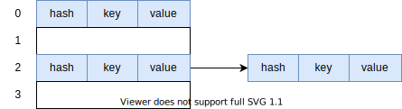

# 底层存储元素的Node结构

HashMap是Map接口的一种实现类，用于存储键值对。既然要存储，底层要么是数组要么是链表。HashMap的底层是数组，每个数组的元素里就需要包含key和value这2部分的信息。怎么设计这样一个数据结构呢？最简单的例子代码如下：

```java
public class KeyValuePair<K, V> {

    private final K key;
    private final V value;

    public KeyValuePair(K key, V value) {
        this.key = key;
        this.value = value;
    }

    public K getKey() {
        return key;
    }

    public V getValue() {
        return value;
    }
}
```

但事实上HashMap用于存储Key和Value的数据结构不是像`KeyValuePair<K, V>`这样，而是要比这个复杂一点，因为上面的结构不能处理当不同的key被hash映射到数组的同一个位置时的冲突情况。HashMap内部用于存储键值对的结构是这样的：

```java
class Node<K,V> implements Map.Entry<K,V> {
    final int hash;
    final K key;
    V value;
    Node<K,V> next;

    Node(int hash, K key, V value, Node<K,V> next) {
        this.hash = hash;
        this.key = key;
        this.value = value;
        this.next = next;
    }

    public final K getKey()        { return key; }
    public final V getValue()      { return value; }
    public final String toString() { return key + "=" + value; }

    public final int hashCode() {
        return Objects.hashCode(key) ^ Objects.hashCode(value);
    }

    public final V setValue(V newValue) {
        V oldValue = value;
        value = newValue;
        return oldValue;
    }

    public final boolean equals(Object o) {
        if (o == this)
            return true;
        if (o instanceof Map.Entry) {
            Map.Entry<?,?> e = (Map.Entry<?,?>)o;
            if (Objects.equals(key, e.getKey()) &&
                Objects.equals(value, e.getValue()))
                return true;
        }
        return false;
    }
}
```

这个`Node<K,V>`结构实现了`Map.Entry<K,V>`接口，多了一个int类型的hash字段，同时它有个next字段使得多个`Node<K,V>`结构可以串成一个单链表的结构。

那么用图形来说明一个HashMap存放有部分数据时其底层的存储结构大致如下：



> 底层是长度为4的数组，虽然存了3个元素，但是有2个元素hash冲突，放在一个链表中了。

# put方法的实现

## putVal

HashMap底层的`Node<K,V>`的数组变量名字是table，一个新建的HashMap，还没有put进数据时，这个table其实是null。因此put时首先要判断table是不是null，如果是，就需要先初始化一个数组，不是的话就不需要，然后把元素存储，最后还要判断增加一个元素后数组的size是不是已经超过要扩容的阈值，超过的话就要库容一次。

初始化和扩容其实是一样的逻辑，只不过一个是从0到n，一个是从n到2n，因此在源码里是用同一个方法来完成初始化和扩容，这个方法叫`resize`

这个逻辑可以在源码里看到：

`put`方法的代码如下：

```java
public V put(K key, V value) {
    return putVal(hash(key), key, value, false, true);
}
```

实际是调用`putVal`方法：

```java
final V putVal(int hash, K key, V value, boolean onlyIfAbsent,
                   boolean evict) {
    Node<K,V>[] tab; Node<K,V> p; int n, i;
    if ((tab = table) == null || (n = tab.length) == 0)
        // 先tab = table，这样，在tab = resize()的时候, tab的新值不会影响到table的旧值
        // 如果tab为null，或者是一个长度为0的空数组，需要用resize初始化
        n = (tab = resize()).length;
    if ((p = tab[i = (n - 1) & hash]) == null)
        // 如果hash出来的索引位置为null，那么没有hash冲突，直接new一个新的节点，放在这个位置即可
        tab[i] = newNode(hash, key, value, null);
    else {
        // 否则，说明发生了Hash冲突，需要解决冲突。
        // 解决冲突有3种情况：
        // 1. key得到的hash相同，同时key本身也相同，那么说明是要用一个新的Value覆盖旧的Value，替换链表首位的Node的Value就可以了
        // 2. 不满足1，链首的节点是Node<K, V>结构的子类TreeNode<K, V>，那么说明这条链之前因为太长变成了红黑树，需要按照红黑树的情形来处理
        // 3. 普通冲突，需要从头遍历单链表，如果找到一个key相同的Node，说明是覆盖旧Value，否则是put了一个没有个key，那么在链表的尾部加一个Node。

        Node<K,V> e; K k;
        // 此时p是这个冲突位置的链首节点
        if (p.hash == hash && ((k = p.key) == key || (key != null && key.equals(k))))
            // 情况1：没有hash冲突
            e = p;
        else if (p instanceof TreeNode)
            // 情况2：有冲突，并且节点红黑树，调用putTreeVal方法完成红黑树操作。
            e = ((TreeNode<K,V>)p).putTreeVal(this, tab, hash, key, value);
        else {
            // 情况3：普通冲突，遍历单链表
            for (int binCount = 0; ; ++binCount) {
                if ((e = p.next) == null) {
                    p.next = newNode(hash, key, value, null);
                    if (binCount >= TREEIFY_THRESHOLD - 1) // -1 for 1st
                        treeifyBin(tab, hash);
                    break;
                }
                // 找到了key相同的节点，说明是覆盖操作，不用继续遍历了。
                if (e.hash == hash &&
                    ((k = e.key) == key || (key != null && key.equals(k))))
                    break;
                p = e;
            }
        }
        // 3种情况分别做了不同的处理，最终得到要要替换Value值的这个节点e
        if (e != null) { // existing mapping for key
            V oldValue = e.value;
            if (!onlyIfAbsent || oldValue == null)
                e.value = value;
            // afterNodeAccess是一个空方法，没有作用，给子类扩展用的，暂且当其不存在
            afterNodeAccess(e);
            return oldValue;
        }
    }
    // 新put的Value已经存储起来了，后面是“相对不重要的逻辑”

    // put次数的一个历史记录而已
    ++modCount;
    if (++size > threshold)
        // 元素太多，冲突概率大了，需要resize，和开始出掉resize一样，不过此时是扩容。
        resize();

    // afterNodeInsertion是一个空方法，没有作用，给子类扩展用的，暂且当其不存在
    afterNodeInsertion(evict);
    return null;
}
```

put的主体逻辑在代码注释中描述了，还有2个“黑盒”方法没有剖析：`resize`和`putTreeVal`,一个用于扩容，一个用于红黑树操作。

## resize扩容

resize的扩容逻辑分为2个部分：

1. 已知当前的容量oldCap，当前的扩容阈值threshold，需要决定能不能继续扩容，以及能扩容的话扩容到多大，同时设置下次扩容的阈值。用数学的语言描述要解决的问题：已知旧容量`oldCap`，旧阈值`oldThreshold`，要计算得到新容量`newCap`,新的阈值`newThreshold`
2. 得到了新容量后，new一个响应长度的新数组，遍历旧数组的值，填充到新的数组中去。涉及到数组的遍历，链表的遍历，红黑树的遍历。

### 计算新容量和新阈值

容量`cap`比较好理解，就是数组的长度，如果数组是null，容量是0。阈值`threshold`呢？它其实是决定要不要扩容的一个临界值。在put方法中会判断size和threshold和关系，如果`size > threshold`那么才会调用resize方法。HashMap并不会在size刚好达到容量才resize，而是在size达到容量的`75%`时就resize，这个`75%`就是“负载因子”，用浮点数变量`loadFactor`存储。因此`threshold = cap * loadFactor`

这段逻辑看起来比较简单，但是考虑到边界情况就变复杂一点了。因为不能无限扩容，而是有一个上限，在HashMap中定义了常量`MAXIMUM_CAPACITY = 1 << 30`。

1. 如果旧容量是0，即初始化场景，又分2种情况：
  - 旧阈值不为0，那么新容量直接等于旧阈值。这在调用有参构造函数设置了初始化容量后第一次resize时会出现。
  - 旧阈值不为0，那么新容量等于一个设定的约定值`DEFAULT_INITIAL_CAPACITY = 1 << 4`。 这在调用了无参构造函数后第一次resize时会出现。
2. 如果旧容量大于0，即扩容场景，也分2种情况：
  - 旧容量不仅大于0，而且很大，超过了`MAXIMUM_CAPACITY = 1 << 30`， 那么后续再也不需要扩容了，为了阻止`size > threshold`, 要设置`threshold = Integer.MAX_VALUE`, 然后就直接return返回，因为再不需要扩容了。
  - 旧容量不仅大于0，但是没有超过`MAXIMUM_CAPACITY`，那么容量直接Double，至于阈值要不要Double，得满足2个条件，新的容量没有超过`MAXIMUM_CAPACITY`, 且旧的容量大于等于`DEFAULT_INITIAL_CAPACITY`

在上面的逻辑过后，新的阈值要是还是0，那么就按公式计算一个出来：`threshold = (float) newCap * loadFactor`, 但是因为转了float，这个数可能大于Integer.MAX_VALUE，如果这样那就设置threshold为Integer.MAX_VALUE

实现的代码如下，为`resize`方法的前半段：

```java
Node<K,V>[] oldTab = table;
int oldCap = (oldTab == null) ? 0 : oldTab.length;
int oldThr = threshold;
int newCap, newThr = 0;
if (oldCap > 0) {
    if (oldCap >= MAXIMUM_CAPACITY) {
        threshold = Integer.MAX_VALUE;
        return oldTab;
    } else if ((newCap = oldCap << 1) < MAXIMUM_CAPACITY && oldCap >= DEFAULT_INITIAL_CAPACITY)
        newThr = oldThr << 1;
} else if (oldThr > 0)
    newCap = oldThr;
else {
    newCap = DEFAULT_INITIAL_CAPACITY;
    newThr = (int)(DEFAULT_LOAD_FACTOR * DEFAULT_INITIAL_CAPACITY);
}
if (newThr == 0) {
    float ft = (float)newCap * loadFactor;
    newThr = (newCap < MAXIMUM_CAPACITY && ft < (float)MAXIMUM_CAPACITY ? (int)ft : Integer.MAX_VALUE);
}
threshold = newThr;
```

### 填充新数组

前面已经得到新的数组的容量`newCap`, 先按这个容量new一个Node数组出来

`Node<K,V>[] newTab = (Node<K,V>[])new Node[newCap]`

然后遍历旧数组，把数据都搬到新的数组里，最后把新`newTab`return回去

填充新数组的过程利用了一个重要的性质：

**如果一个key在旧数组中没有hash冲突，那么在新的数组中必然也不会hash冲突；而如果多个key在旧的数组中发生了hash冲突，形成了一个单链表，那么扩容后冲突率不会上升，最坏的情况是它们仍然还是一个链表，一般的情况应该是被拆解成了2个长度更短的链表；红黑树的情况也差不多，会将为2个更小的红黑树或者单链表**

而之所以产生这个性质，是来源于HashMap的设计：

当`n = 1 << m`,即n是2的幂时，如果`x & n-1 = A`，而`y & n-1 = B`，且`A != B`时，那么必然有`x & 2n-1 != y & 2n-1`，因为当`x & n-1 = A`时，`x & 2n-1`要么等于`A`，要么等于`A+n`, 同理`y & n-1 = B`时`y & 2n-1 = B`要么仍然为`B`,要么为`B+n`。 当`A != B`时，以下4个值必然两两不等：

- A
- B
- A+n
- B+n

以一个例子来图示：

```txt
X011010     X011010
 111111     1111111
-------     -------
 011010     X011010
```

**这就是为什么HashMap的底层数组的容量cap需要是2的幂，扩容时也是Double，而不是加一个什么固定的数字。而由hash映射到数组索引时用的是hash&(n-1），就是为了产生上面的性质。**

`resize`的后半段代码：

```java
Node<K,V>[] newTab = (Node<K,V>[])new Node[newCap];
table = newTab;
if (oldTab != null) {
    for (int j = 0; j < oldCap; ++j) {
        Node<K,V> e;
        if ((e = oldTab[j]) != null) {
            // 显然，遍历的过程中，只关心不为null的节点
            oldTab[j] = null;
            if (e.next == null)
                // 旧的数组里没有hash冲突，在新的数组里必然也没有hash冲突，直接重新用新的newCap减1后和key的hash执行与操作得到索引
                newTab[e.hash & (newCap - 1)] = e;
            else if (e instanceof TreeNode)
                // 在旧的数组里是发生过hash冲突的，而且是红黑树结构，那么拆解红黑树，这里封装为一个独立的方法里，而且把newTab传过去，在这个方法里把拆解出来的Node放入newTab
                ((TreeNode<K,V>)e).split(this, newTab, j, oldCap);
            else { // preserve order
                // 发生么Hash冲突，没有红黑树，而是单链表。那么拆解单链表。从单链表里拆解出来的节点必然不会需要变红黑树结构，而是成为2个更短的链表。
                Node<K,V> loHead = null, loTail = null;
                Node<K,V> hiHead = null, hiTail = null;
                Node<K,V> next;
                do {
                    next = e.next;
                    if ((e.hash & oldCap) == 0) {
                        if (loTail == null)
                            loHead = e;
                        else
                            loTail.next = e;
                        loTail = e;
                    }
                    else {
                        if (hiTail == null)
                            hiHead = e;
                        else
                            hiTail.next = e;
                        hiTail = e;
                    }
                } while ((e = next) != null);
                if (loTail != null) {
                    loTail.next = null;
                    newTab[j] = loHead;
                }
                if (hiTail != null) {
                    hiTail.next = null;
                    newTab[j + oldCap] = hiHead;
                }
            }
        }
    }
}
return newTab;
```

`resize`遍历旧的table，对每个数组中的非null节点，有3种情况：

1. 此节点(就是前面代码种的节点e)的next为null，说明此处没有发生过hash冲突，直接新计算出索引index，然后放在新数组种即可。新的index要么是旧的index，要么是旧的index加上旧的数组容量，这个是为什么，前面已经说了。

2. 此节点e的next非null，说明发生过hash冲突，但是e的类型不是TreeNode，那么是单链表，需要拆解单链表。

2. 此节点e的next非null，说明发生过hash冲突，而且e的类型是TreeNode，那么是红黑树，需要拆解红黑树。

### 拆解单链表

拆解单链表的逻辑可以看上面的一段代码，并没有封装为一个单独的方法。

它实现的效果是这样的：



原本的一条链表被分成了2条更短的单链表（极端情况下，有一条链表仍为空，另一条的长度和原来仍相同）。所以代码中先弄了4个节点出来：

`Node<K,V> loHead = null, loTail = null;`

`Node<K,V> hiHead = null, hiTail = null;`

分成了高低2条链，然后遍历一次原链表就可以拆分出来。至于一个节点是在高链还是低链，看`(e.hash & oldCap) == 0`是否成立。

### 拆解红黑树

拆解红黑树的逻辑就比拆解单链表要复杂很多了，因此封装为一个方法`split`了, 如下：

```java
final void split(HashMap<K,V> map, Node<K,V>[] tab, int index, int bit) {
    TreeNode<K,V> b = this;
    // Relink into lo and hi lists, preserving order
    TreeNode<K,V> loHead = null, loTail = null;
    TreeNode<K,V> hiHead = null, hiTail = null;
    int lc = 0, hc = 0;
    for (TreeNode<K,V> e = b, next; e != null; e = next) {
        next = (TreeNode<K,V>)e.next;
        e.next = null;
        if ((e.hash & bit) == 0) {
            if ((e.prev = loTail) == null)
                loHead = e;
            else
                loTail.next = e;
            loTail = e;
            ++lc;
        }
        else {
            if ((e.prev = hiTail) == null)
                hiHead = e;
            else
                hiTail.next = e;
            hiTail = e;
            ++hc;
        }
    }

    if (loHead != null) {
        if (lc <= UNTREEIFY_THRESHOLD)
            tab[index] = loHead.untreeify(map);
        else {
            tab[index] = loHead;
            if (hiHead != null) // (else is already treeified)
                loHead.treeify(tab);
        }
    }
    if (hiHead != null) {
        if (hc <= UNTREEIFY_THRESHOLD)
            tab[index + bit] = hiHead.untreeify(map);
        else {
            tab[index + bit] = hiHead;
            if (loHead != null)
                hiHead.treeify(tab);
        }
    }
}
```

先把红黑树调整为2棵更小的树，再判断下小树的节点数是不是小于了UNTREEIFY_THRESHOLD，如果是，将红黑树转为单链表。

## putTreeVal红黑树加节点


# 未完待续
