# 对象内存布局

在HotsSpot虚拟机里，对象在堆内存中的存储布局可以分为3个部分：

- 对象头（Header）
- 实例数据 (Instance Data)
- 对齐填充（Padding）

而对象头又由2个部分组成：

- MarkWord
- 类型指针

MarkWord的长度在32为和64位虚拟机中分别位32bit和64bit。类型指针在32位虚拟机上是4个字节32bit，而在64位虚拟机开启指针压缩时仍然位32bit，未开启指针压缩则为64bit（默认是开启的）。

考虑到虚拟机的内存利用效率，MarkWord被设计称一个具有动态定义的数据结构，部分bit表示的意义并不是固定的，而是不同的状态下表示不同的意义，具体如下图所示：

32位虚拟机：



64位虚拟机：



# JOL（Java Object Layout）验证

JOL是“Java Object Layout”，OpenJdk提供了一个开源的类库可以帮助我们展示对象的内存布局信息。用mavne下载jar包的坐标地址是：

```xml
<dependency>
    <groupId>org.openjdk.jol</groupId>
    <artifactId>jol-core</artifactId>
    <version>0.14</version>
</dependency>
```

接下来我们用此工具来查看对象的内存布局。

写一个简单的类：

```java
import org.openjdk.jol.info.ClassLayout;

public class Test {

    private int num;

    public static void main(String[] args) {
        System.out.println(ClassLayout.parseClass(Test.class).toPrintable());
    }

}
```

执行之，得到的输出大致如下：

```txt
Test object internals:
 OFFSET  SIZE   TYPE DESCRIPTION                               VALUE
      0    12        (object header)                           N/A
     12     4    int Test.num                                  N/A
Instance size: 16 bytes
Space losses: 0 bytes internal + 0 bytes external = 0 bytes total
```

因为我们是解析的Test类，而不是一个Test类的实例，因此没有什么bit信息显示出来，但是我们可以知道，Test实例在内存中占用16个字节。其中对象头12个字节，实例数据是一个int占4个字节。对象头的12个字节前8个字节是MarkWord，后4个字节是类型指针（从这里也可以看出默认开启了指针压缩）。

修改下代码：

```java
import org.openjdk.jol.info.ClassLayout;

public class Test {

    private int num;

    public Test(int num) {
        this.num = num;
    }

    public static void main(String[] args) {
        System.out.println(ClassLayout.parseInstance(new Test(10)).toPrintable());
    }

}
```

执行之，得到输出：

```txt
Test object internals:
 OFFSET  SIZE   TYPE DESCRIPTION                               VALUE
      0     4        (object header)                           05 00 00 00 (00000101 00000000 00000000 00000000) (5)
      4     4        (object header)                           00 00 00 00 (00000000 00000000 00000000 00000000) (0)
      8     4        (object header)                           08 fa 16 00 (00001000 11111010 00010110 00000000) (1505800)
     12     4    int Test.num                                  10
Instance size: 16 bytes
Space losses: 0 bytes internal + 0 bytes external = 0 bytes total
```

对比前面的布局图，可以看出应该存放hashCode的bit全部是0，这是因为hashCode是懒计算的，要直接或者简介调用了对象的hashCode方法猜出出发计算并写入MarkWord

## 验证HashCode

修改代码，显示的调用实例的hashCode方法：

```java
import org.openjdk.jol.info.ClassLayout;

public class Test {

    private int num;

    public Test(int num) {
        this.num = num;
    }

    public static void main(String[] args) {
        Test test = new Test(10);
        int hashCode = test.hashCode();
        System.out.println(String.format("HashCode is : (%s) (%s) (%d)", Integer.toHexString(hashCode), Integer.toBinaryString(hashCode), hashCode));
        System.out.println(ClassLayout.parseInstance(test).toPrintable());
    }
}

```

输出：

```txt
HashCode is : (3b9a45b3) (111011100110100100010110110011) (999966131)
Test object internals:
 OFFSET  SIZE   TYPE DESCRIPTION                               VALUE
      0     4        (object header)                           01 b3 45 9a (00000001 10110011 01000101 10011010) (-1706708223)
      4     4        (object header)                           3b 00 00 00 (00111011 00000000 00000000 00000000) (59)
      8     4        (object header)                           08 fa 16 00 (00001000 11111010 00010110 00000000) (1505800)
     12     4    int Test.num                                  10
Instance size: 16 bytes
Space losses: 0 bytes internal + 0 bytes external = 0 bytes total
```

从这个输出可以看出，64位HotSlot虚拟机中，内存的字节是大端字节序（Big Endian）：最高有效位存于最低内存地址处，最低有效位存于最高内存处。按大端序来看，MarkWord中未使用的25个bit前24个bit就是offet未5，6，7的3个字节。offset为4，3，2，1的4个字节组成的16进制数正好和打印出的hashCode的16进制表示“3b9a45b3”相同。而offset为0的字节，只有最后一个bit是1，说明是未锁定状态。

## 验证对齐

64位虚拟机中，对象的起始地址是以8字节对齐的，不足的会补齐整，例如：

```java
import org.openjdk.jol.info.ClassLayout;

public class Test {

    private long num;

    public Test(long num) {
        this.num = num;
    }

    public static void main(String[] args) {
        Test test = new Test(100L);
        System.out.println(ClassLayout.parseInstance(test).toPrintable());
    }
}
```

输出：

```txt
Test object internals:
 OFFSET  SIZE   TYPE DESCRIPTION                               VALUE
      0     4        (object header)                           05 00 00 00 (00000101 00000000 00000000 00000000) (5)
      4     4        (object header)                           00 00 00 00 (00000000 00000000 00000000 00000000) (0)
      8     4        (object header)                           08 fa 16 00 (00001000 11111010 00010110 00000000) (1505800)
     12     4        (alignment/padding gap)
     16     8   long Test.num                                  100
Instance size: 24 bytes
Space losses: 4 bytes internal + 0 bytes external = 4 bytes total
```

可以看到，对象头和实例数据之间有4个字节的对齐padding

如果我们给Test加一个int的字段，int刚好4个字节，那么刚好放入这个padding的地方：

```java
import org.openjdk.jol.info.ClassLayout;

public class Test {

    private long num;
    private int num2;


    public Test(long num, int num2) {
        this.num = num;
        this.num2 = num2;
    }

    public static void main(String[] args) {
        Test test = new Test(100L, 99);
        System.out.println(ClassLayout.parseInstance(test).toPrintable());
    }
}
```

输出：

```txt
Test object internals:
 OFFSET  SIZE   TYPE DESCRIPTION                               VALUE
      0     4        (object header)                           05 00 00 00 (00000101 00000000 00000000 00000000) (5)
      4     4        (object header)                           00 00 00 00 (00000000 00000000 00000000 00000000) (0)
      8     4        (object header)                           08 fa 16 00 (00001000 11111010 00010110 00000000) (1505800)
     12     4    int Test.num2                                 99
     16     8   long Test.num                                  100
Instance size: 24 bytes
Space losses: 0 bytes internal + 0 bytes external = 0 bytes total
```

可以看到，确实如此。

如果我们再加一个int：

```java
import org.openjdk.jol.info.ClassLayout;

public class Test {

    private long num;
    private int num2;
    private int num3;


    public Test(long num, int num2, int num3) {
        this.num = num;
        this.num2 = num2;
        this.num3 = num3;
    }

    public static void main(String[] args) {
        Test test = new Test(100L, 99, 999);
        System.out.println(ClassLayout.parseInstance(test).toPrintable());
    }
}
```

输出：

```txt
Test object internals:
 OFFSET  SIZE   TYPE DESCRIPTION                               VALUE
      0     4        (object header)                           05 00 00 00 (00000101 00000000 00000000 00000000) (5)
      4     4        (object header)                           00 00 00 00 (00000000 00000000 00000000 00000000) (0)
      8     4        (object header)                           08 fa 16 00 (00001000 11111010 00010110 00000000) (1505800)
     12     4    int Test.num2                                 99
     16     8   long Test.num                                  100
     24     4    int Test.num3                                 999
     28     4        (loss due to the next object alignment)
Instance size: 32 bytes
Space losses: 0 bytes internal + 4 bytes external = 4 bytes total
```

这次，padding是加载了最尾部，而不是中间。JVM会自动为每个字段选取合适的位置，而不是一定要和类文件中字段的定义顺序一致。


## 锁状态

```java
import org.openjdk.jol.info.ClassLayout;

public class Test {

    private int num;

    public Test(int num) {
        this.num = num;
    }

    public static void main(String[] args) {
        Test test = new Test(100);
        System.out.println(ClassLayout.parseInstance(test).toPrintable() + "\n");
        synchronized (test) {
            long threadId = Thread.currentThread().getId();
            String msg = String.format("Current thread id: (%s) (%s) (%s)", Long.toHexString(threadId), Long.toBinaryString(threadId), threadId);
            System.out.println(msg);
            System.out.println(ClassLayout.parseInstance(test).toPrintable());
        }
    }
}
```

输出：

```txt
Test object internals:
 OFFSET  SIZE   TYPE DESCRIPTION                               VALUE
      0     4        (object header)                           05 00 00 00 (00000101 00000000 00000000 00000000) (5)
      4     4        (object header)                           00 00 00 00 (00000000 00000000 00000000 00000000) (0)
      8     4        (object header)                           08 fa 16 00 (00001000 11111010 00010110 00000000) (1505800)
     12     4    int Test.num                                  100
Instance size: 16 bytes
Space losses: 0 bytes internal + 0 bytes external = 0 bytes total


Current thread id: (1) (1) (1)
Test object internals:
 OFFSET  SIZE   TYPE DESCRIPTION                               VALUE
      0     4        (object header)                           05 98 80 38 (00000101 10011000 10000000 00111000) (947951621)
      4     4        (object header)                           eb 7f 00 00 (11101011 01111111 00000000 00000000) (32747)
      8     4        (object header)                           08 fa 16 00 (00001000 11111010 00010110 00000000) (1505800)
     12     4    int Test.num                                  100
Instance size: 16 bytes
Space losses: 0 bytes internal + 0 bytes external = 0 bytes total
```

第二段输出语句处于synchronized块中，offset为0的字节的bit为“00000101”，可以看出，当前处于可偏向状态。


## 其他

关于GC，数组类型等也可以写测试代码通过jol提供的api来测试验证。

参考文章:

https://www.baeldung.com/java-memory-layout

https://shipilev.net/jvm/objects-inside-out/
