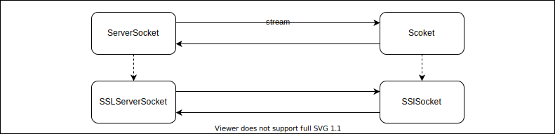

# 1. JDK中SSL编程简单介绍

普通的Socket编程中, 一旦服务端的`ServerSocket`通过`accept`得到一个`Socket`和客户端的`Socket`建立连接,接下来就可以进行双向的字节流传输了:

Server
```java
ServerSocket serverSocket = new ServerSocket(8080);
Socket accept = serverSocket.accept();
```

Client
```java
Socket socket = new Socket();
socket.connect(new InetSocketAddress("127.0.0,1", 80));
```

在SSL socket编程时,有与`ServerSocket`对应的`SSLServerSocket`, 与`Socket`对应的`SSLSocket`. 一旦服务端得到正确实例化好的`SSLServerSocket`对象,客户端得到正确实例化
好的`SSLSocket`对象，那么服务端把`SSLServerSocket`当成普通的`ServerSocket`对象来使用，而客户端把`SSLSocket`当成普通的`Socket`对象来使用，则后续的字节流传输操作就是一模一样的。





因此SSL Socket编程相比普通的Socet编程复杂的地方就在于服务端得到`SSLServerSocket`实例和客户端`SSLSocket`实例。

和普通的Socket编程可以直接使用`new`来新建Socket实例不同，为了API更易于使用，JDK不能直接通过`new`操作来得到`SSLServerSocket`实例和`SSLSocket`实例，而是要通过工厂类来得到实例。

Server
```java
SSLServerSocketFactory sslServerSocketFactory;
SSLServerSocket sslServerSocket = (SSLServerSocket) sslServerSocketFactory.createServerSocket(9000);
SSLSocket socket = (SSLSocket) sslServerSocket.accept();
```

Client
```java
SSLSocketFactory sslSocketFactory;
SSLSocket socket = (SSLSocket) sslSocketFactory.createSocket();
```

因此现在的问题是如何得到`SSLServerSocketFactory`实例和`SSLSocketFactory`实例。它们需要通过`SSLContext`实例来生成：

Server
```java
SSLContext serverSslContext; 
SSLServerSocketFactory sslServerSocketFactory = serverSslContext.getServerSocketFactory();
```

Client
```java
SSLContext clientSslContext;
SSLSocketFactory sslServerSocketFactory = clientSslContext.getSocketFactory();
```

因此现在的问题是如何得到`SSLContext`实例。



单向认证的情况下，SSLContext对于服务端来说，包含了SSL证书信息和服务端用到的密钥对信息（公钥用于发送给客户端，私钥用于自己解密）；SSLContext对于客户端来说包含了自己信任的证书信息，
其实就是要把服务端的证书加入到自己的信任列表。 

双向认证的情况下，客户端也要有自己的证书信息和密钥对信息，且服务端也把客户端的证书信息加入到自己的信任列表。

JDK把证书信息和信任信息的表达做了接口抽象，然后有很多的实现类。就是图中的`KeyManager`，`TrustManager`， 以及它们的工厂类，`KeyManagerFactory`和`TrustManagerFactory`。

因此为了最终得到`SSLContext`实例，需要准备好合适的证书文件，然后用证书文件得到`KeyManagerFactory`和`TrustManagerFactory`实例。


# 2. 证书制作

证书制作可以通过2个命令来实现：

1. openssl
2. keytool

安装了JDK的情况下可以使用keytool命令。

下面演示用`keytool`命令依次生成所需的密钥和证书信息。

先准备一个空的目录，所有命令均在此目录执行。服务端的需要的信息放在名为`server.keystore`的keystore文件，文件读取密码设置为`server123`;客户端需要的信息放在名为`client.keystore`的keystore文件中，文件的读取密码设置为`client123`

## 2.1 服务端密钥对和证书信息生成

### 首先为服务端生成自己的密钥对

```sh
keytool -genkeypair -keyalg RSA -keysize 2048 -alias server_key -keystore server.keystore -storepass server123
```

命令执行后需要输入密钥对拥有者相关的6项信息。适当编造输入即可。命令会在目录生成一个名为`server.keystore`的新文件，可以用`keytool -list`命令查看包含的信息条目：

```sh
keytool -list -keystore server.keystore -storepass server123
```

输出类似如下：

```txt
密钥库类型: PKCS12
密钥库提供方: SUN

您的密钥库包含 1 个条目

server_key, 2022年6月17日, PrivateKeyEntry, 
证书指纹 (SHA-256): 90:B3:FE:AD:8F:7E:97:A0:98:8E:A3:E9:94:29:1B:63:1E:A3:72:B8:18:D8:F7:30:17:4B:5D:8B:D4:0A:82:8E
```

可以看到名为`server_key`的条目，它包含了服务端的私钥信息，不能暴露给客户端。如果要把这个条目导出到一个单独的文件`server.key`，可以使用如下的命令：

```sh
keytool -exportcert -keystore server.keystore -storepass server123 -alias server_key -file server.key
```

该命令会生成名为`server.key`的文件。（生成这个文件不是必须的）

### 服务端使用生成的密钥对信息生成证书请求文件

要用密钥信息得到证书文件，得先生成一个"生成证书请求文件":

```sh
keytool -certreq -keystore server.keystore -storepass server123 -alias server_key -file server.cert.req
```

此命令会生成一个新的文件`server.cert.req`，用于下一步生成证书文件。

- 生成证书文件

生成证书文件的命令如下：

```sh
keytool -gencert -keystore server.keystore -storepass server123 -alias server_key -infile server.cert.req -outfile server.cert
```

此命令会生成一个新的文件`server.cert`，即服务端的证书文件。

可以用如下命令查看证书的信息：

```sh
keytool -printcert -file server.cert
```

输入类似如下：

```txt
所有者: CN=Alice, OU=Alice.LDT, O=IT, L=Wuhan, ST=Hubei, C=CN
发布者: CN=Alice, OU=Alice.LDT, O=IT, L=Wuhan, ST=Hubei, C=CN
序列号: d1aa3f7f6a4a0432
生效时间: Fri Jun 17 00:40:15 CST 2022, 失效时间: Thu Sep 15 00:40:15 CST 2022
证书指纹:
	 SHA1: 95:B7:BE:F2:87:CD:24:69:D9:87:47:C8:A4:62:FB:86:CB:19:59:B3
	 SHA256: DE:78:72:12:E7:56:42:11:95:2A:A6:37:70:2B:33:25:0D:2D:D3:D8:C8:3E:70:8D:5C:24:3B:A5:11:C2:B7:F1
签名算法名称: SHA256withRSA
主体公共密钥算法: 2048 位 RSA 密钥
版本: 3

扩展: 

#1: ObjectId: 2.5.29.14 Criticality=false
SubjectKeyIdentifier [
KeyIdentifier [
0000: 18 53 B9 28 F7 26 E5 EC   20 0A E8 D3 6A 1B 9E D8  .S.(.&.. ...j...
0010: 02 18 07 50                                        ...P
]
]
```

可以看出，所有者和发布者的信息是一样的，这是因为这个生成证书是自签名的根证书。如果不用自签名，而是使用权威机构的根证书来签名，那么发布者信息就是根证书发布机构的信息，一般在实际生产环境中是需要用权威机构的根证书来签名自己的证书的。

最后因为JDK的API初始化`KeyManagerFactory`是通过读取keystore文件来配置的，现在我们把刚生成的证书文件`server.cert`再导入到`server.keystore`文件中存储。

```sh
keytool -importcert -keystore server.keystore -storepass server123 -file server.cert
```

命令执行后会被询问是否信任要被导入的证书，输入`y`即可。

## 2.2 客户端需要的文件生成

单向认证的情况下，客户端不需要自己有证书，只需要把服务端的证书设置为自己信任的证书。

我们为客户端生成一个单独的名为`client.keystore`的keystore文件，设置密码为`client123`，并同样把`server.cert`导入其中并信任：

```sh
keytool -importcert -keystore client.keystore -storepass client123 -file server.cert
```

执行后同样输入`y`即可。


# 3 代码

## 3.1 服务端代码

SslTcpServer.java
```java
import java.io.InputStream;
import java.io.OutputStream;
import java.net.ServerSocket;
import java.net.Socket;
import java.nio.charset.StandardCharsets;
import java.nio.file.Files;
import java.nio.file.Paths;
import java.security.KeyStore;
import javax.net.ssl.KeyManagerFactory;
import javax.net.ssl.SSLContext;
import javax.net.ssl.SSLServerSocketFactory;

public class SslTcpServer {

    public static void main(String[] args) throws Exception {
        char[] keyStorePass = "server123".toCharArray();
        KeyStore keyStore = KeyStore.getInstance("JKS");
        keyStore.load(Files.newInputStream(Paths.get("./server.keystore")), keyStorePass);
        KeyManagerFactory keyManagerFactory = KeyManagerFactory.getInstance("SunX509");
        keyManagerFactory.init(keyStore, keyStorePass);
        SSLContext serverSslContext = SSLContext.getInstance("TLSv1.3");
        serverSslContext.init(keyManagerFactory.getKeyManagers(), null, null);
        SSLServerSocketFactory serverSocketFactory = serverSslContext.getServerSocketFactory();
        ServerSocket serverSocket = serverSocketFactory.createServerSocket(8080);
        System.out.println("Server listening ...");
        Socket socket = serverSocket.accept();
        System.out.println("accepted ...");
        InputStream inputStream = socket.getInputStream();
        byte[] buffer = new byte[256];
        int readByteCount = inputStream.read(buffer);
        System.out.println("Received: " + new String(buffer, 0, readByteCount));
        OutputStream outputStream = socket.getOutputStream();
        outputStream.write("Hello from SslTcpServer".getBytes(StandardCharsets.UTF_8));
        outputStream.flush();
        outputStream.close();
        inputStream.close();
        socket.close();
        serverSocket.close();
    }

}
```

SslTcpClient.java
```java
import java.io.InputStream;
import java.io.OutputStream;
import java.net.InetSocketAddress;
import java.net.Socket;
import java.nio.charset.StandardCharsets;
import java.nio.file.Files;
import java.nio.file.Paths;
import java.security.KeyStore;
import javax.net.ssl.SSLContext;
import javax.net.ssl.SSLSocketFactory;
import javax.net.ssl.TrustManagerFactory;

public class SslTcpClient {

    public static void main(String[] args) throws Exception {
        char[] keyStorePass = "client123".toCharArray();
        KeyStore keyStore = KeyStore.getInstance("JKS");
        keyStore.load(Files.newInputStream(Paths.get("./client.keystore")), keyStorePass);
        TrustManagerFactory trustManagerFactory = TrustManagerFactory.getInstance("SunX509");
        trustManagerFactory.init(keyStore);
        SSLContext clientSslContext = SSLContext.getInstance("TLSv1.3");
        clientSslContext.init(null, trustManagerFactory.getTrustManagers(), null);
        SSLSocketFactory socketFactory = clientSslContext.getSocketFactory();
        Socket socket = socketFactory.createSocket();
        socket.connect(new InetSocketAddress("127.0.0.1", 8080));
        OutputStream outputStream = socket.getOutputStream();
        outputStream.write("Hello from SslTcpClient".getBytes(StandardCharsets.UTF_8));
        outputStream.flush();
        InputStream inputStream = socket.getInputStream();
        byte[] buffer = new byte[256];
        int readByteCount = inputStream.read(buffer);
        System.out.println("Received: " + new String(buffer, 0, readByteCount));
        outputStream.close();
        inputStream.close();
        socket.close();
    }

}
```

先启动SslTclServer

```sh
javac SslTcpServer.java
java SslTcpServer
```

可以看到输出：

```txt
Server listening ...
```

再启动SslTcpClient

```sh
javac SslTcpClient.java
java SslTcpClient
```

可以立马看到客户端输出：

```text
Received: Hello from SslTcpServer
```

同时，服务端增加输出：

```txt
Received: Hello from SslTcpClient
```

# 4 TLSv1.3握手过程分析

**TODO**

# 5. 附：生成配置nginx的证书文件和私钥文件

前面涉及到keytool命令生成的证书文件和密钥文件都不是PEM格式的，而nginx配置ssl相关的证书需要pem格式的文件，需要做一下格式转换才能在配置nginx时使用。

## 5.1 证书文件

- 方法1:

把前面生成`server.cert`的命令加一个`-rfc`的参数即可生成nginx能用的证书文件：

```sh
keytool -gencert -keystore server.keystore -storepass server123 -alias server_key -infile server.cert.req -rfc -outfile server.cert.pem
```

- 方法2:

直接用openssl命令转化：

```sh
openssl x509 -inform der -in server.cert -out server.cert.pem
```

> 2种方式得到的文件内容不是一模一样的，但是都是正确的，都可以用于配置nginx

## 5.2 私钥文件

前面有个命令生成了`server.key`文件就是私钥文件，但是不能被nginx使用，keytool貌似没有提供命令直接把这个文件转化为pem格式的**私钥文件**（只能转化为证书文件）。要实现
转化得写java调用JDK里的keytool相关的库才行，另一个可行的办法是用`openssl`命令：

先把`server.keystore`中alias名为的`server_key`这个key抽出来放在单独的pkcs12格式的文件`server.key.p12`

    ```sh
keytool -importkeystore -srckeystore server.keystore -srcstorepass server123 -srcstoretype jks -srcalias server_key -destkeystore server.key.p12 -deststoretype PKCS12 -destalias server_key -deststorepass server789
    ```

再用openssl命令：

```sh
# 命令帮助: openssl pkcs12 -help
openssl pkcs12 -in server.key.p12 -noenc -nocerts -out server.key.pem
# 会要求输入密码，输入前面的命令设置的密码：server789
```

## 5.3 配置nginx

最后得到的文件`server.cert.pem`和`server.key.pem`可以用于配置nginx：

```
ssl_certificate /path/to/server.cert.pem;
ssl_certificate_key /path/to/server.key.pem;
```
