从非常粗的粒度来描述spring-boot应用的启动过程,大致可以分为以下几个阶段:



- 构造阶段

  主要就是new一个SpringApplication实例子

- 配置阶段

  配置SpringApplication, 加载环境配置文件

- 准备ApplicationContext

- 运行ApplicationContext

# 1. 观察者模式

使用spring-boot开发spring应用,能够免去繁琐的xml配置,非常快速的开发一个简单的spring应用.这是因为spring-boot按照"约定优于配置"做了很多默认配置.

光有"约定优于配置",而不能"自行配置以覆盖约定"肯定不行,因此spring-boot也提供了非常好的扩展机制来改变spring-boot的默认行为,以及我们可以自定义扩展spring-boot的功能.而这一切,都是建立在"观察者模式"的基础之上,因此,理解好"观察者模式"能帮助更好的理解spring-boot的启动过程.

观察者模式是指在被观察者的状态发生变化时,系统基于事件驱动将其状态通知到订阅其状态的观察者对象中,以完成状态的修改和事件传播,这种模式有时又叫做"发布-订阅"模式:事件发布者发布事件, 事件监听者响应事件.



下面是非常简单的demo代码:

Event.java

```java
public interface Event {

    String getMessage();

}
```

StartEvent.java

```java
public class StartEvent implements Event {

    @Override
    public String getMessage() {
        return "start";
    }

}
```

StopEvent.java

```java
public class StopEvent implements Event {

    @Override
    public String getMessage() {
        return "stop";
    }

}
```

EventListener.java

```java
public interface EventListener {

    void onEvent(Event event);

}
```

FooEventListener.java

```java
public class FooEventListener implements EventListener {

    @Override
    public void onEvent(Event event) {
        System.out.println("FooEventListener handle " + event.getMessage());
    }

}
```

BarEventListener.java

```java
public class BarEventListener implements EventListener {

    @Override
    public void onEvent(Event event) {
        System.out.println("BarEventListener handle " + event.getMessage());
    }

}
```

EventPublish.java

```java
public class EventPublisher {
SpringApplication
    public List<EventListener> eventListeners = new ArrayList<>(8);

    public void register(EventListener eventListener) {
        eventListeners.add(eventListener);
    }

    public void publishEvent(Event event) {
        for (EventListener listener : eventListeners) {
            listener.onEvent(event);
        }
    }

}
```

Main.java

```java
public class Main {

    public static void main(String[] args) {
        EventPublisher eventPublisher = new EventPublisher();
        eventPublisher.register(new FooEventListener());
        eventPublisher.register(new BarEventListener());
        eventPublisher.publishEvent(new StartEvent());
        eventPublisher.publishEvent(new StopEvent());
    }

}
```

运行Main,则会输出:

```txt
FooEventListener handle start
BarEventListener handle start
FooEventListener handle stop
BarEventListener handle stop
```

这几段代码是非常浅显易懂的,这种模式的一大好处就是"易扩展": 随着程序的启动,有一个事件发布者,在不同的阶段,发布不同的事件,我们可以自己定义事件监听者注册到事件发布者之上,然后在事件发布者发布事件后,会回调我们定义的响应函数,从而达到扩展的目的.

spring的易扩展机制正是建立在此基础之上, spring-boot内部正有这么一个事件发布者:`org.springframework.context.event.ApplicationEventMulticaster`, 这是一个接口,其实我们还可以自己定义发布者发布事件.该接口的最终非抽象实现类是:`org.springframework.context.event.SimpleApplicationEventMulticaster`

spring-boot内部的事件接口是:`org.springframework.context.ApplicationEvent`, (这个接口其实是spring定义的), 而spring-boot中有这些该接口的实现类(仅列出部分和spring-boot启动过程生命周期相关的):

-  ApplicationStartingEvent
-  ApplicationEnvironmentPreparedEvent
-  ApplicationContextInitializedEvent
-  ApplicationPreparedEvent
-  ApplicationStartedEvent
- ApplicationReadyEvent
- ApplicationFailedEvent

spring-boot内部的事件监听者接口是`org.springframework.context.ApplicationListener`, 该接口有非常多的实现类,这里举2个例子:

- ConfigFileApplicationListener
- FileEncodingApplicationListener

整个spring-boot应用启动的过程用观察者模式来描述:


图中蓝色部分表示spring-boot的内置组件,这些组件构成了spring-boot的默认行文, 而在此观察者模式的基础上,我们可以自己定义"红色部分", 用于在spring-boot的启动过程中扩展spring-boot的功能,实现我们的功能.

说明: 上面的图中红色的部分都是在蓝色的下方, 其实不一定,spring-boot提供得了排序机制,我们可以自己定义各个监听器的优先级.

# 2. 构造SpringApplication

从宏观上了解了Spring-Boot使用观察者模式驱动其生命周期向前推进的机制后,下面深入到各个阶段的细节中去.

第一个阶段就是构造SpringApplication实例.

如果我们不需要对SpringApplication做一些个性化定制,那么调用SpringApplication类的静态方法"run",即可启动一个spring-boot应用.这个静态run方法背后也是要先new一个SpringApplication实例,然后再调用其实例"run"方法.

```java
public static void main(String[] args) {
    SpringApplication.run(Demo.class, args);
}
```

```java
public static ConfigurableApplicationContext run(Class<?> primarySource, String... args) {
    return run(new Class<?>[] { primarySource }, args);
}
```

```java
public static ConfigurableApplicationContext run(Class<?>[] primarySources, String[] args) {
			return new SpringApplication(primarySources).run(args);
}
```

如果我们不想用调用静态run方法的方式启动spring-boot,可以自己new一个SpringApplication实例,然后调用各种set方法做自定义设置,最后再调用实例run方法.

比如,自定义Banner:

```java
public class Demo {

    public static void main(String[] args) {
        SpringApplication springApplication = new SpringApplication(Demo.class);
        springApplication.setBanner((environment, sourceClass, out) -> {
            out.println("my custom banner");
        });
        springApplication.run(args);
    }

}
```

## 2.1 SpringApplication的构造方法

SpringApplication的构造方法:

```java
public SpringApplication(ResourceLoader resourceLoader, Class<?>... primarySources) {
    this.resourceLoader = resourceLoader;
    Assert.notNull(primarySources, "PrimarySources must not be null");
    this.primarySources = new LinkedHashSet<>(Arrays.asList(primarySources));
    this.webApplicationType = WebApplicationType.deduceFromClasspath();
    setInitializers((Collection) getSpringFactoriesInstances(ApplicationContextInitializer.class));
    setListeners((Collection) getSpringFactoriesInstances(ApplicationListener.class));
    this.mainApplicationClass = deduceMainApplicationClass();
}
```

在这个构造方法里,做了2件比较重要的事情:

1. 推断Web应用类型
2. 设置Initializers和Listeners

## 2.1.1 推断Web应用类型

Web应用类型分为三种:

- 非Web应用
- 基于Servlet的Web应用
- 基于Reactive的Web应用 (所谓的反应式编程)

spring-boot实现的推断逻辑很简单,根据类路径上是否有期望的类来判断:

```java
static WebApplicationType deduceFromClasspath() {
    if (ClassUtils.isPresent(WEBFLUX_INDICATOR_CLASS, null) && !ClassUtils.isPresent(WEBMVC_INDICATOR_CLASS, null)
		    && !ClassUtils.isPresent(JERSEY_INDICATOR_CLASS, null)) {
	    return WebApplicationType.REACTIVE;
    }
    for (String className : SERVLET_INDICATOR_CLASSES) {
	    if (!ClassUtils.isPresent(className, null)) {
		    return WebApplicationType.NONE;
	    }
    }
    return WebApplicationType.SERVLET;
}
```

这也就是为什么引入"spring-boot-starter-web"或者引入"spring-boot-starter-webflux"后,spring-boot自动设置了Web应用类型.

### 2.1.2 设置Initializers和tListeners

设置Initializers和tListeners的2行代码和前面说的观察者模式驱动spring-boot的生命周期向前推进息息相关,就是这2个代码设置好了事件发布者,并在事件发布者上注册了各种事件监听器.

设置Initializers和tListeners背后都调用了'getSpringFactoriesInstances'方法,

```java
private <T> Collection<T> getSpringFactoriesInstances(Class<T> type, Class<?>[] parameterTypes, Object... args) {
    ClassLoader classLoader = getClassLoader();
    // Use names and ensure unique to protect against duplicates
    Set<String> names = new LinkedHashSet<>(SpringFactoriesLoader.loadFactoryNames(type, classLoader));
    List<T> instances = createSpringFactoriesInstances(type, parameterTypes, classLoader, args, names);
    AnnotationAwareOrderComparator.sort(instances);
    return instances;
}
```

这段代码里核心逻辑是`SpringFactoriesLoader.loadFactoryNames`

该方法签名:

```java
public static List<String> loadFactoryNames(Class<?> factoryType, @Nullable ClassLoader classLoader);
```

从这个签名可以知道该方法作用:给定一个Class类型,返回一组String. (先不考虑classLoader)

返回的String是什么呢?

我们可以写一段测试代码测试一下:

```java
import java.util.List;

import org.springframework.context.ApplicationListener;
import org.springframework.core.io.support.SpringFactoriesLoader;

public class Test {

    public static void main(String[] args) {
        List<String> strings = SpringFactoriesLoader.loadFactoryNames(ApplicationListener.class, Thread.currentThread().getContextClassLoader());
        for (String s : strings) {
            System.out.println(s);
        }
    }

}
```

这段代码的输出:

```txt
org.springframework.boot.ClearCachesApplicationListener
org.springframework.boot.builder.ParentContextCloserApplicationListener
org.springframework.boot.cloud.CloudFoundryVcapEnvironmentPostProcessor
org.springframework.boot.context.FileEncodingApplicationListener
org.springframework.boot.context.config.AnsiOutputApplicationListener
org.springframework.boot.context.config.ConfigFileApplicationListener
org.springframework.boot.context.config.DelegatingApplicationListener
org.springframework.boot.context.logging.ClasspathLoggingApplicationListener
org.springframework.boot.context.logging.LoggingApplicationListener
org.springframework.boot.liquibase.LiquibaseServiceLocatorApplicationListener
org.springframework.boot.autoconfigure.BackgroundPreinitializer
```

可以看出,输出的是一些类的全限定类名,而且都是我们传的参数"ApplicationListener.class"这个接口的实现类.

也就是说loadFactoryNames能得到给定的一个接口的一些实现类的全限定类名,既然得到了类名了,下一步当然就可以用反射的方式得到这些类的实例,进而设置到SpringApplication中去.

那么,这些类名从那里来的呢?其实这些类都定义在spring-boot的jar包中一个名为"META-INF/spring.factories"的文件,这其实就是一个简单的properties文件:

spring.factories:

```ini
# PropertySource Loaders
org.springframework.boot.env.PropertySourceLoader=\
org.springframework.boot.env.PropertiesPropertySourceLoader,\
org.springframework.boot.env.YamlPropertySourceLoader

# Run Listeners
org.springframework.boot.SpringApplicationRunListener=\
org.springframework.boot.context.event.EventPublishingRunListener

# Error Reporters
org.springframework.boot.SpringBootExceptionReporter=\
org.springframework.boot.diagnostics.FailureAnalyzers

# Application Context Initializers
org.springframework.context.ApplicationContextInitializer=\
org.springframework.boot.context.ConfigurationWarningsApplicationContextInitializer,\
org.springframework.boot.context.ContextIdApplicationContextInitializer,\
org.springframework.boot.context.config.DelegatingApplicationContextInitializer,\
org.springframework.boot.rsocket.context.RSocketPortInfoApplicationContextInitializer,\
org.springframework.boot.web.context.ServerPortInfoApplicationContextInitializer

# Application Listeners
org.springframework.context.ApplicationListener=\
org.springframework.boot.ClearCachesApplicationListener,\
org.springframework.boot.builder.ParentContextCloserApplicationListener,\
org.springframework.boot.cloud.CloudFoundryVcapEnvironmentPostProcessor,\
org.springframework.boot.context.FileEncodingApplicationListener,\
org.springframework.boot.context.config.AnsiOutputApplicationListener,\
org.springframework.boot.context.config.ConfigFileApplicationListener,\
org.springframework.boot.context.config.DelegatingApplicationListener,\
org.springframework.boot.context.logging.ClasspathLoggingApplicationListener,\
org.springframework.boot.context.logging.LoggingApplicationListener,\
org.springframework.boot.liquibase.LiquibaseServiceLocatorApplicationListener

# Environment Post Processors
org.springframework.boot.env.EnvironmentPostProcessor=\
org.springframework.boot.cloud.CloudFoundryVcapEnvironmentPostProcessor,\
org.springframework.boot.env.SpringApplicationJsonEnvironmentPostProcessor,\
org.springframework.boot.env.SystemEnvironmentPropertySourceEnvironmentPostProcessor,\
org.springframework.boot.reactor.DebugAgentEnvironmentPostProcessor

# Failure Analyzers
org.springframework.boot.diagnostics.FailureAnalyzer=\
org.springframework.boot.context.properties.NotConstructorBoundInjectionFailureAnalyzer,\
org.springframework.boot.diagnostics.analyzer.BeanCurrentlyInCreationFailureAnalyzer,\
org.springframework.boot.diagnostics.analyzer.BeanDefinitionOverrideFailureAnalyzer,\
org.springframework.boot.diagnostics.analyzer.BeanNotOfRequiredTypeFailureAnalyzer,\
org.springframework.boot.diagnostics.analyzer.BindFailureAnalyzer,\
org.springframework.boot.diagnostics.analyzer.BindValidationFailureAnalyzer,\
org.springframework.boot.diagnostics.analyzer.UnboundConfigurationPropertyFailureAnalyzer,\
org.springframework.boot.diagnostics.analyzer.ConnectorStartFailureAnalyzer,\
org.springframework.boot.diagnostics.analyzer.NoSuchMethodFailureAnalyzer,\
org.springframework.boot.diagnostics.analyzer.NoUniqueBeanDefinitionFailureAnalyzer,\
org.springframework.boot.diagnostics.analyzer.PortInUseFailureAnalyzer,\
org.springframework.boot.diagnostics.analyzer.ValidationExceptionFailureAnalyzer,\
org.springframework.boot.diagnostics.analyzer.InvalidConfigurationPropertyNameFailureAnalyzer,\
org.springframework.boot.diagnostics.analyzer.InvalidConfigurationPropertyValueFailureAnalyzer

# FailureAnalysisReporters
org.springframework.boot.diagnostics.FailureAnalysisReporter=\
org.springframework.boot.diagnostics.LoggingFailureAnalysisReporter

```

可以看到,里面的key不止有`org.springframework.context.ApplicationListener`,还有其他的key,我们可以再以其他的类作为参数验证"`SpringFactoriesLoader.loadFactoryNames`"的功能:

```java
import java.util.List;

import org.springframework.boot.env.EnvironmentPostProcessor;
import org.springframework.core.io.support.SpringFactoriesLoader;

public class Test {

    public static void main(String[] args) {
        List<String> strings = SpringFactoriesLoader.loadFactoryNames(EnvironmentPostProcessor.class, Thread.currentThread().getContextClassLoader());
        for (String s : strings) {
            System.out.println(s);
        }
    }

}
```

此代码的输出:

```txt
org.springframework.boot.cloud.CloudFoundryVcapEnvironmentPostProcessor
org.springframework.boot.env.SpringApplicationJsonEnvironmentPostProcessor
org.springframework.boot.env.SystemEnvironmentPropertySourceEnvironmentPostProcessor
org.springframework.boot.reactor.DebugAgentEnvironmentPostProcessor
```

可以看到,和spring.factories文件中定义的键值对吻合.

`SpringFactoriesLoader`的作用就是加载jar包中的"spring.factories"文件,至于它具体是怎么实现的,这里就不细说了,看一下它的源码,并不难理解.

`SpringFactoriesLoade`并不只是单单会读取spring-boot的jar包中的`spring.factories`文件,而是会读取类路径上所有的jar包中的`spring.factories`文件,如果我们在我们自己的项目中编写`spring.factories`文件,也会被加载.

另外`SpringFactoriesLoade`只会在第一次加载时读取一次文件,然后将所有的键值对缓存起来,而不是每次调用其方法都会读文件, 这个可以从源码中看到.

# 3. 开始启动spring-boot应用

新建了SpringApplication实例之后,已经读取"spring.factories"文件设置好了"ApplicationListener",下一步就是调用实例run方法了,而在实例run方法之初,就是新建"事件发布者", 并将先前设置的ApplicationListener注册到"事件发布者", 也就是下面的代码中的这一行`SpringApplicationRunListeners listeners = getRunListeners(args);`

```java
public ConfigurableApplicationContext run(String... args) {
    StopWatch stopWatch = new StopWatch();
    stopWatch.start();
    ConfigurableApplicationContext context = null;
    Collection<SpringBootExceptionReporter> exceptionReporters = new ArrayList<>();
    configureHeadlessProperty();
    SpringApplicationRunListeners listeners = getRunListeners(args);
    listeners.starting();
    try {
        ApplicationArguments applicationArguments = new DefaultApplicationArguments(args);
        ConfigurableEnvironment environment = prepareEnvironment(listeners, applicationArguments);
        configureIgnoreBeanInfo(environment);
        Banner printedBanner = printBanner(environment);
        context = createApplicationContext();
        exceptionReporters = getSpringFactoriesInstances(SpringBootExceptionReporter.class,
                new Class[] { ConfigurableApplicationContext.class }, context);
        prepareContext(context, environment, listeners, applicationArguments, printedBanner);
        refreshContext(context);
        afterRefresh(context, applicationArguments);
        stopWatch.stop();
        if (this.logStartupInfo) {
            new StartupInfoLogger(this.mainApplicationClass).logStarted(getApplicationLog(), stopWatch);
        }
        listeners.started(context);
        callRunners(context, applicationArguments);
    }
    catch (Throwable ex) {
        handleRunFailure(context, ex, exceptionReporters, listeners);
        throw new IllegalStateException(ex);
    }

    try {
        listeners.running(context);
    }
    catch (Throwable ex) {
        handleRunFailure(context, ex, exceptionReporters, null);
        throw new IllegalStateException(ex);
    }
    return context;
}
```

`getRunListeners`的方法的实现:

```java
private SpringApplicationRunListeners getRunListeners(String[] args) {
    Class<?>[] types = new Class<?>[] { SpringApplication.class, String[].class };
    return new SpringApplicationRunListeners(logger, getSpringFactoriesInstances(SpringApplicationRunListener.class, types, this, args));
}
```

先看`SpringApplicationRunListeners`的构造函数:

```java
SpringApplicationRunListeners(Log log, Collection<? extends SpringApplicationRunListener> listeners) {
    this.log = log;
    this.listeners = new ArrayList<>(listeners);
}
```

非常简单的逻辑,就是设置一下属性,关键的属性就是"listeners",这个"listeners"从何而来?

由`getSpringFactoriesInstances`方法而来, 这个方法的背后又用到了前面讲到过的"SpringFactoriesLoader"

SpringFactoriesLoader加载的是`SpringApplicationRunListener.class`

回到前面的"spring.factories"文件,其中有:

```properties
# Run Listeners
org.springframework.boot.SpringApplicationRunListener=\
org.springframework.boot.context.event.EventPublishingRunListener
```

所以这里是用反射得到了`EventPublishingRunListener`类的实例.

因此,"listeners"就是一个是有一个元素的list,这个元素就是`EventPublishingRunListener`,看名字就知道他就是前面多次提到的"事件发布者",既然它是事件发布者,那么各种事件监听者就要注册在其上.

`EventPublishingRunListener`只有一个构造函数:

```java
public EventPublishingRunListener(SpringApplication application, String[] args) {
    this.application = application;
    this.args = args;
    this.initialMulticaster = new SimpleApplicationEventMulticaster();
    for (ApplicationListener<?> listener : application.getListeners()) {
        this.initialMulticaster.addApplicationListener(listener);
    }
}
```

可以看到,需要一个参数`SpringApplication`, 然后get其listeners,然后循环遍历,通过addApplicationListener注册到了底层真正的"事件发布者":`SimpleApplicationEventMulticaster`

`SimpleApplicationEventMulticaster`之后就会调用其`multicastEvent`方法发布事件了,发布事件和逻辑本质就和前面的观者者模式demo代码一样的了,就是一个循环遍历.只是`SimpleApplicationEventMulticaster`的功能当然会复杂和完善得多.

# 4. 发布事件: ApplicationStartingEvent

事件发布者准备好了,事件监听者也已经注册到了事件发布者,接下来就是发布事件,推动spring-boot的生命周期向前发展了.

第一个发布的事件就是"ApplicationStartingEvent",其实就是紧接着`getRunListeners`之后的一行代码:

```java
listeners.starting();
```

注意这个是复数"listeners", 它是事件监听者"们"的管理者,而不是事件监听者本身.

下一层调用:

```java
void starting() {
    for (SpringApplicationRunListener listener : this.listeners) {
        listener.starting();
    }
}
```

循环,调用每个"SpringApplicationRunListener"实例的`starting`,通过前面的分析,这里其实就只有一个"SpringApplicationRunListener", 就是"EventPublishingRunListener", 继续看"EventPublishingRunListener"的`starting`方法:

```java
public void starting() {
    this.initialMulticaster.multicastEvent(new ApplicationStartingEvent(this.application, this.args));
}
```

调用底层的`SimpleApplicationEventMulticaster`真正发布了"ApplicationStartingEvent"

继续追下n层调用:

```java
public void multicastEvent(final ApplicationEvent event, @Nullable ResolvableType eventType) {
    ResolvableType type = (eventType != null ? eventType : resolveDefaultEventType(event));
    Executor executor = getTaskExecutor();
    for (ApplicationListener<?> listener : getApplicationListeners(event, type)) {
        if (executor != null) {
            executor.execute(() -> invokeListener(listener, event));
        }
        else {
            invokeListener(listener, event);
        }
    }
}
```

可以看到,在循环里对每个注册在其上的`ApplicationListener`,执行了`invokeListener`方法(暂时不考虑直接同步调用和用线程池执行的区别):

```java
protected void invokeListener(ApplicationListener<?> listener, ApplicationEvent event) {
    ErrorHandler errorHandler = getErrorHandler();
    if (errorHandler != null) {
        try {
            doInvokeListener(listener, event);
        }
        catch (Throwable err) {
            errorHandler.handleError(err);
        }
    }
    else {
        doInvokeListener(listener, event);
    }
}
```

```java
private void doInvokeListener(ApplicationListener listener, ApplicationEvent event) {
    try {
        listener.onApplicationEvent(event);
    }
    catch (ClassCastException ex) {
        String msg = ex.getMessage();
        if (msg == null || matchesClassCastMessage(msg, event.getClass())) {
            // Possibly a lambda-defined listener which we could not resolve the generic event type for
            // -> let's suppress the exception and just log a debug message.
            Log logger = LogFactory.getLog(getClass());
            if (logger.isTraceEnabled()) {
                logger.trace("Non-matching event type for listener: " + listener, ex);
            }
        }
        else {
            throw ex;
        }
    }
}
```

这里就调用了`ApplicationListener`的`onApplicationEvent`方法,同时传递了`ApplicationEvent`为参数.

那都有那些`ApplicationListener`对`ApplicationStartingEvent`做出了响应,又作出了何种响应呢?

前面在讲`SpringFactoriesLoader`时已经分析出了一共有11个监听器注册,但是并不是都关注`ApplicationStartingEvent`

`ApplicationListener`有一个子接口`SmartApplicationListener`:

```java
public interface SmartApplicationListener extends ApplicationListener<ApplicationEvent>, Ordered {

    boolean supportsEventType(Class<? extends ApplicationEvent> eventType);

    default boolean supportsSourceType(@Nullable Class<?> sourceType) {
        return true;
    }

    @Override
    default int getOrder() {
        return LOWEST_PRECEDENCE;
    }

}
```

它多了一个"表明是否支持某事件类型"的功能,前面的各种Listener基本都实现了此接口.

前面的代码里,可以看到`multicastEvent`方法里遍历的集合是`getApplicationListeners`方法返回的结果,而不是一个固定的集合.

这个`getApplicationListeners`最终调用了`supportsEvent`:

```java
protected boolean supportsEvent(
        ApplicationListener<?> listener, ResolvableType eventType, @Nullable Class<?> sourceType) {
    GenericApplicationListener smartListener = (listener instanceof GenericApplicationListener ?
            (GenericApplicationListener) listener : new GenericApplicationListenerAdapter(listener));
    return (smartListener.supportsEventType(eventType) && smartListener.supportsSourceType(sourceType));
}
```

最终会对`ApplicationStartingEvent`作出响应的只有4个Listener,按先后顺序,依次是:

- LoggingApplicationListener

  日志系统初始化

- BackgroundPreinitializer

  初始化化一个些备用线程池,

- DelegatingApplicationListener

  "委托模式",可以实现二级,乃至三级的监听事件分发

- LiquibaseServiceLocatorApplicationListener

  使用开源库`Liquibase`实现数据库自动migration,只有在'Liquibase'的依赖在类路径上时才会发挥作用.

这4个Listener对"ApplicationStartingEvent"作出的响应比较少需要去修改和定制其行为,就不一一分析了.

# 5. ApplicationEnvironmentPreparedEvent

下一个发布的比较重要的事件是`ApplicationEnvironmentPreparedEvent`。spirng-boot会先初始化出默认的`Environment`，然后发布`ApplicationEnvironmentPreparedEvent`，让我们可以注册自己的监听器对`ApplicationEnvironmentPreparedEvent`做出响应，从而可以修改，扩展，自定义`Environment`。

这个环境准备的阶段还涉及到一个比较重要的接口`EnvironmentPostProcessor`，看看前面贴的`spring.factories`文件的内容，它有4个实现类会被`SpringFactoriesLaoder`加载：

```properties
# Environment Post Processors
org.springframework.boot.env.EnvironmentPostProcessor=\
org.springframework.boot.cloud.CloudFoundryVcapEnvironmentPostProcessor,\
org.springframework.boot.env.SpringApplicationJsonEnvironmentPostProcessor,\
org.springframework.boot.env.SystemEnvironmentPropertySourceEnvironmentPostProcessor,\
org.springframework.boot.reactor.DebugAgentEnvironmentPostProcessor
```

同样的问题，有那些Listener会关注`ApplicationEnvironmentPreparedEvent`，同时又做出什么样的响应呢？

- ConfigFileApplicationListener
- AnsiOutputApplicationListener
- LoggingApplicationListener
- ClasspathLoggingApplicaitonListener
- BackgroundPreinitializer
- DelegatingApplicationListener
- FileEncodingApplicationListener

这里面比较重要的是`ConfigFileApplicationListener`，它的主要功能就是使用`SpringFactoriesLaoder`加载`EnvironmentPostProcessor`的实现类，然后调用它们：

```java
private void onApplicationEnvironmentPreparedEvent(ApplicationEnvironmentPreparedEvent event) {
    List<EnvironmentPostProcessor> postProcessors = loadPostProcessors();
    postProcessors.add(this);
    AnnotationAwareOrderComparator.sort(postProcessors);
    for (EnvironmentPostProcessor postProcessor : postProcessors) {
        postProcessor.postProcessEnvironment(event.getEnvironment(), event.getSpringApplication());
    }
}

List<EnvironmentPostProcessor> loadPostProcessors() {
    return SpringFactoriesLoader.loadFactories(EnvironmentPostProcessor.class, getClass().getClassLoader());
}
```

了解到这个机制之后，如果我们想对spring-boot的`Environment`做自定义扩展，那么我们就可以实现`EnvironmentPostProcessor`接口，在`postProcessEnvironment`方法里对环境做出自定义修改。比如，可以实现在`application.yml`中配置DataSource时使用密文，而`postProcessEnvironment`中实现解密。

## 5.1 何谓“环境”

简单来理解，环境就是“配置”，初始化环境，就是初始化配置。

举个简单的例子,一个应用要连接数据库，那就要有数据库的url,我们把数据库url写在配置文件中，并且有2个不同的文件：

a.properties:

```properties
url = jdbc:mariadb://127.0.0.1:3306/test
```

b.properties:

```properties
url = jdbc:mariadb://10.10.10.10:5678/test
```

那么应用使用了不同的配置文件，就连接了不同的数据库，称之为运行于不同的环境。像这种配置，其实就是键值对，反映在Java代码层面就是`Map`，不同的环境，从Map里取一样的key，得到的value是不一样，这个不同的value进而会影响后续程序的行为。

Spring并没有直接使用Map，而是**抽象**出一个接口`PropertyResolver`来描述`环境`这个东西所具有的由一个key获取到某个value的能力：

```java
public interface PropertyResolver {

	boolean containsProperty(String key);

	@Nullable
	String getProperty(String key);

	String getProperty(String key, String defaultValue);

	@Nullable
	<T> T getProperty(String key, Class<T> targetType);

	<T> T getProperty(String key, Class<T> targetType, T defaultValue);

	String getRequiredProperty(String key) throws IllegalStateException;

	<T> T getRequiredProperty(String key, Class<T> targetType) throws IllegalStateException;

	String resolvePlaceholders(String text);

	String resolveRequiredPlaceholders(String text) throws IllegalArgumentException;

}
```

> 开源项目往往"发明"很多概念让人去学，比如spring中的`BeanFactory`，`ApplicationContext`，`Environment`，`Resource`等等，其实一个概念的发明就是`对某种能力的抽象`，抽象的结果往往就是一个接口，或者一个抽象类。把我一个项目的设计思想和设计理念，就看它对什么样的能力抽象出了什么样的概念。

围绕`PropertyResolver`相关的一些对环境概念进行抽象的接口之间的继承关系：


蓝色的4个是接口，绿色的`AbstractEnvironment`是一个抽象类，这个抽象类里就实现了`PropertyResolver`中的核心`能力定义`：`String getProperty(String key);`

```java
@Override
@Nullable
public String getProperty(String key) {
    return this.propertyResolver.getProperty(key);
}
```

`AbstractEnvironment`仅仅只是调用了其属性`propertyResolver`的getProperty方法。而`propertyResolver`属性本身的类型就是`ConfigurablePropertyResolver`，是`PropertyResolver`接口的子接口，所以这里其实是一个委托，关键还是看它委托的对象怎么实现`getProperty`的。

`AbstractEnvironment`的属性是在构造之前就初始化为一个final属性的：

```java
private final ConfigurablePropertyResolver propertyResolver = new PropertySourcesPropertyResolver(this.propertySources);
```

这里又引申除了2个东西：`propertySources`属性和`PropertySourcesPropertyResolver`类。

`PropertySourcesPropertyResolver`在构造是要传`propertySources`，那我们只需要看看`PropertySourcesPropertyResolver`内部是如何实现`getProperty`的：

```java
@Nullable
protected <T> T getProperty(String key, Class<T> targetValueType, boolean resolveNestedPlaceholders) {
    if (this.propertySources != null) {
        for (PropertySource<?> propertySource : this.propertySources) {
            if (logger.isTraceEnabled()) {
                logger.trace("Searching for key '" + key + "' in PropertySource '" +
                        propertySource.getName() + "'");
            }
            Object value = propertySource.getProperty(key);
            if (value != null) {
                if (resolveNestedPlaceholders && value instanceof String) {
                    value = resolveNestedPlaceholders((String) value);
                }
                logKeyFound(key, propertySource, value);
                return convertValueIfNecessary(value, targetValueType);
            }
        }
    }
    if (logger.isTraceEnabled()) {
        logger.trace("Could not find key '" + key + "' in any property source");
    }
    return null;
}
```

可以看到，propertySources是一个PropertySource的迭代，这段逻辑就是依次从每个`PropertySource`中尝试去`getProperty`，如果从某个`PropertySource`中拿到非null的value，就可以结束迭代了，只是在结束迭代之间，还需要解析`${}`这种形式的变量引用，背后有一个“递归调用的过程”，因为引用可以多级应用，形成引用链。

现在的逻辑落脚到了`PropertySource`的`getProperty`方法。而`PropertySource`是一个抽象类，它并没有实现`getProperty`方法，而是留给子类去实现，那么它有那些子类呢？它有很多子类， 包括但不限于：

- MapPropertySource
- RandomValuePropertySource
- SimpleCommandLinePropertySource
- SystemEnvironmentPropertySource
- PropertiesPropertySource

从类的名字我们就可以大概知道spring的设计者想表达的意思：要由一个key得到一个value，那么我可以有不同的各种方式：

1. 从一个Map中去获取
2. 随即生成一个value
3. 从命令行参数中去解析
4. 从系统环境变量中去查找
5. 从properties文件中查找

另外，我们还可以按直接想法去实现:

1. 比如，从yaml文件中去解析
2. 甚者，通过网络，从一个远程的服务器去查询。（分布式配置中心）

既然有这么多种不同的方式，那么当他们同时存在时，并且一个key在不同的获取方式中都可拿到非null的value，以谁的为准呢？这就涉及到一个优先级的关系。

我们自己来写一段测试代码，来测试一下经过spring的层层设计和封装后`AbstractEnvironment`最终暴露出来的能力：

`AbstractEnvironment`虽然是抽象类，但是它没有抽象方法（这可能是作者忘记将`customizePropertySources`方法定义为抽象方法了，或者有什么其他的考虑）。子类应该覆盖其`customizePropertySources`方法，来设置其`PropertySource`迭代器，表明其具有用那些方式获取key对应value的能力。

定义一个简单的`AbstractEnvironment`的子类：

```java
public class MyEnv extends AbstractEnvironment {

    public MyEnv() {
        super();
    }

    @Override
    protected void customizePropertySources(MutablePropertySources propertySources) {
        Map<String, Object> map = new HashMap<>(8);
        map.put("name", "alice");
        map.put("address", "shenzhen");
        map.put("message", "hello");
        map.put("USER", "alice");
        String propertiesFileName = "/tmp/test.properties";
        Properties properties = new Properties();
        try {
            properties.load(Files.newInputStream(Paths.get(propertiesFileName)));
        } catch (IOException e) {
            //
        }
        propertySources.addLast(new PropertiesPropertySource("ps1", properties));
        propertySources.addLast(new MapPropertySource("ps2", map));
        propertySources.addFirst(new SystemEnvironmentPropertySource("ps3", getSystemEnvironment()));
    }

}
```

接下来写段代码测试其行为：

```java
public class Test {

    public static void main(String[] args) {
        MyEnv myEnv = new MyEnv();
        System.out.println(myEnv.getProperty("name"));
        System.out.println(myEnv.getProperty("address"));
        System.out.println(myEnv.getProperty("message"));
        System.out.println(myEnv.getProperty("USER"));
    }

}
```

修改”/tmp/test.properties“的文件内容， 配置和map一样的key，或者调整propertySources执行add时的顺序，观察测试代码输出结果的变化。

## 5.2 EnvironmentPostProcessor

`ConfigFileApplicationListener`在处理`ApplicationEnvironmentPreparedEvent`事件时，使用`SpringFactoriesLoader`加载了`EnvironmentPostProcessor`并依次执行它们的`postProcessEnvironment`方法，给了我们一个机会去修改和定制spring-boot为我们初始化的环境。一个实现密文解密的例子：

```java
public class ParsePasswordEnvironmentPostProcessor implements EnvironmentPostProcessor {

    @Override
    public void postProcessEnvironment(ConfigurableEnvironment environment, SpringApplication application) {
        String password = environment.getProperty("password");
        if (null == password) {
            return;
        }
        // 使用toUpperCase逻辑替代解密
        String passwordDecrypted = password.toUpperCase();
        HashMap<String, Object> map = new HashMap<>(2);
        map.put("password", passwordDecrypted);
        environment.getPropertySources().addFirst(new MapPropertySource("passwordDecrypt", map));
    }

}
```

注意，使用的是`addFirst`，将新加入的`PropertySource`设置为最高优先级，这样才能起到覆盖作用。

# 6. 准备ApplicationContext
