## synchronized的语义

synchronized是java语言层面的关键字，是最基本的互斥同步手段，它是一种“块结构的”的同步语法。

如果synchronized修饰的是方法，那么用javac编译后，在类的元信息中其flags包含”ACC_SYNCHRONIZED“。

写如下一个简单的类的来测试：

Test.java
```java
public class Test {
    public void test() {
        int a = 1;
        int b = 2;
        int c = a + b;
        System.out.println(c);
    }
}
```

执行`javac Test.java`得到Test.class文件，然后执行`javap -v Test`,将会看到如下输入(只列出相关部分)：

```txt
  public void test();
    descriptor: ()V
    flags: (0x0001) ACC_PUBLIC
    Code:
      stack=2, locals=4, args_size=1
         0: iconst_1
         1: istore_1
         2: iconst_2
         3: istore_2
         4: iload_1
         5: iload_2
         6: iadd
         7: istore_3
         8: getstatic     #7                  // Field java/lang/System.out:Ljava/io/PrintStream;
        11: iload_3
        12: invokevirtual #13                 // Method java/io/PrintStream.println:(I)V
        15: return
      LineNumberTable:
        line 3: 0
        line 4: 2
        line 5: 4
        line 6: 8
        line 7: 15
```

`flags: (0x0001) ACC_PUBLIC`只包含ACC_PUBLIC

修改Test.java代码，test方法加上`synchronized`关键字：

```java
public class Test {
    public synchronized void test() {
        int a = 1;
        int b = 2;
        int c = a + b;
        System.out.println(c);
    }
}
```

重新编译后用javap查看生成的字节码：

```txt
  public synchronized void test();
    descriptor: ()V
    flags: (0x0021) ACC_PUBLIC, ACC_SYNCHRONIZED
    Code:
      stack=2, locals=4, args_size=1
         0: iconst_1
         1: istore_1
         2: iconst_2
         3: istore_2
         4: iload_1
         5: iload_2
         6: iadd
         7: istore_3
         8: return
      LineNumberTable:
        line 3: 0
        line 4: 2
        line 5: 4
        line 6: 8
```

不同之处在于`flags: (0x0021) ACC_PUBLIC, ACC_SYNCHRONIZED`

如果synchronized修饰的是代码块，在经过Javac编译之后，会在代码块的前后分别形成`monitorenter`和`monitorexit`这2个字节码指令。

Test2.java
```java
public class Test2 {
    private Object lock = new Object();
    public void test() {
        synchronized(lock) {
            int a = 1;
            int b = 2;
            int c = a + b;
        }
    }
}
```

编译后用javap查看字节码：

```txt
  public void test();
    descriptor: ()V
    flags: (0x0001) ACC_PUBLIC
    Code:
      stack=2, locals=6, args_size=1
         0: aload_0
         1: getfield      #7                  // Field lock:Ljava/lang/Object;
         4: dup
         5: astore_1
         6: monitorenter
         7: iconst_1
         8: istore_2
         9: iconst_2
        10: istore_3
        11: iload_2
        12: iload_3
        13: iadd
        14: istore        4
        16: aload_1
        17: monitorexit
        18: goto          28
        21: astore        5
        23: aload_1
        24: monitorexit
        25: aload         5
        27: athrow
        28: return
      Exception table:
         from    to  target type
             7    18    21   any
            21    25    21   any
      LineNumberTable:
        line 4: 0
        line 5: 7
        line 6: 9
        line 7: 11
        line 8: 16
        line 9: 28
      StackMapTable: number_of_entries = 2
        frame_type = 255 /* full_frame */
          offset_delta = 21
          locals = [ class Test2, class java/lang/Object ]
          stack = [ class java/lang/Throwable ]
        frame_type = 250 /* chop */
          offset_delta = 6
```

可以看到`monitorenter`和2个`monitorexit`指令，有2个`monitorexit`指令是因为内部会用异常的方式确保同步代码块内发生异常也能执行到`monitorexit`

synchronized的语义，以及monitorenter和monitorexit指令，都是“Java虚拟机规范”层面规定的东西。不同的虚拟机可以有不同的实现。hotspot虚拟机的实现原理是怎么样的呢？

## 锁优化

hotspot应用了各种锁优化的技术去尽可能的提高synchronized的性能，例如适应性自旋，锁消除，偏向锁，轻量级锁等。

在学习hotspot实现的各种锁优化技术之前，需要了解hotspot中一个对象在内存中的布局：


MarkWord是对象头中最前面的一部分，在32位机器上是32bit，64位机器上是64bit。

64位机器上，对象头的内容如下：



一个对象实例化后初始状态下,是处于可偏向状态下的，此时线程id位置处存储的全是比特0，第一个来锁定此对象的线程会获得偏向锁。但是一旦对象计算过HashCode后，偏向模式的bit设置位0，对象就不能再进入偏向模式了。


