**三色标记法**是一种垃圾收集过程中用到的对象标记算法。在Java的CMS，G1等垃圾收集器，GO语言垃圾收集等中都有用到。

对象之间的引用关系可以构成一副有向图，三色标记法把遍历图的过程中遇到的对象按照“是否访问过”这个条件标记成3种颜色：

- **白色**：表示对象尚未被访问过。显然，在开始阶段，所有的对象都是白色的。

- **黑色**：表示对象已经被访问过，并且这个对象的所有引用都已经被访问过。

- **灰色**：表示对象已经被访问过，但是这个对象的所有引用还没有被全部访问。

显然：从GcRoots开始遍历对象图，最终遍历完后，所有对象要么是黑色要么是白色，黑色对象是存活的，而白色的对象表示不可达，是可以被回收的垃圾，而灰色只是遍历过程中的一种中间状态。

如果在遍历对象图的过程中，对象图的结构不会发生改变，那么三色标记法可以正确的分析出每个对象是否”存活“，甚至，都不需要使用三色标记，用2个颜色表示2种状态即可。那如果在遍历对象图的过程中，对象图的结构发生了改变（回收垃圾的同时，用户程序可以并发执行，制造新的“垃圾”），那会出现什么问题呢？会出现“**漏标**”和“**错标**”.

## 漏标

左边是标记过程的中间状态，此时用户程序执行了“`objectB.fieldD = null;`”，导致D没有引用了应该被标记为白色，但是D已经被标记为黑色，本次GC不会回收。这情况是可以容忍的，不会影响程序的正确性，只是会产生“**浮动垃圾**”而已，这样的垃圾在下次GC时是可以被回收的。

## 错标

左边是标记过程的中间状态，此时用户程序执行了`objectB.fieldD = null; objectA.fieldD = D;`，本来D应该被会最终被标记为黑色，但是应用关系变化后，虽然D不是垃圾，有A引用它，但是A已经被标记为黑色（也就是认为A的所有引用字段都被标记过了），因此D不会再被访问，那么D就是白色。这个时候就会影响程序的正确性了，本来不是垃圾的对象被当作垃圾收集了。

在上面的例子中，产生错标有2个条件：

- objectB.fieldD = null
- objectA.fieldD = D

这2行语句必须都存在，如果只存在一条，不会影响程序的正确性：只有`objectB.fieldD = null`,D就应该是白色，继续标记下去D确实是白色；只有`objectA.fieldD = D`,D就应该是黑色，继续标记下去D确实是黑色。

总结归纳下这2个条件：

1. 赋值器插入了一条或多条从从黑色到白色对象X的新引用；
2. 赋值器删除了全部从灰色对象到白色对象X的直接或者间接引用；

因此，我们要解决错标的问题，就需要破坏这2个条件中的任意一个：

- 破坏1：当黑色对象插入新的指向白色对象的引用关系是，就将这个新插入的引用记录下来，等顺着标记的中间状态继续标记完后，再将这些引用关系中的黑色对象取出作为根重新扫描一次。这种方法叫做“**增量更新**”，CMS就是采用的这种方式。

- 破坏2：当灰色对象要删除执行白色对象的引用关系时，就将这个要删除的引用关系记录下来，等顺着标记的中间状态继续标记完后，再将这些引用关系中的灰色对象取出作为根重新扫描一次。这种方法叫做“**原始快照**”，G1就是采用的这种方式。
