# 1. 需求简介

API网关的作用是作为隐藏在后端的各种服务的统一入口，负责将http请求路由到上游的各个后端服务。


网关实例需要对每一个经过网关的请求做审计记录，以便将来可以回答包括但不限于如下问题：

1. 何时，何请求经过了网关
2. 请求的url是什么
3. 响应耗时是多长时间
4. 请求产生的上行流量和下行流量大概是多少个字节
5. 最近一段时间（比如1个小时）有多少个请求通过网关
6. 请求返回的响应状态码是什么
7. 最近一段时间，各个状态码的分布是什么样的
8. 流量趋势

这些问题的回答有利于将来网关的运营。因此需要对通过网关的每一个请求做审计，并统计一些常用的运行指标。

# 2. 总体设计



1. 网关内部有一个全局的过滤器(Filter),将通过网关的API信息发送到kafka
2. kafka的消费者是网关后台管理进程，有2个不同的消费者组：
  - 消费者组1：负责取出原始审计日志后索引到Elasticsearch，以便可以用各种不同的过滤条件来查询原始日志
  - 消费者组2：取出原始日志后，统计可以回到需求中的问题的运营指标，将结果数据写入到mysql，通过网关后台管理平台
  提供接口进行可视化展示

> 网关进程和网关后台进程都是无状态服务，可以水平扩展，也方便部署在Kubernates中。

# 3. 审计过滤器设计

## 3.1 请求审计数据结构设计

| 字段名称 | 类型 | 说明 |
|---|---|---|
|requestId| String | 请求id号 |
|startTimestamp| long | 网关收到请求时间戳，单位毫秒 |
|endTimestamp| long | 网关返回响应时间戳，单位毫秒|
|timeCost| long| 请求耗时，单位毫秒 |
|clientIp| String| 客户端ip|
|httpPath| String | http请求path |
|httpMethod| String | http请求方法 |
|httpStatus| int | http响应状态码 |
|apiId| String | api的id |
|apiVersion| String | api的版本 |
|apiName| String | api的名称 |
|apiGroupId| String | api所属分组id |
|apiHttpMethod| String | api的http请求方法 |
|clientAppName| String | 发起请求的客户端app名称 |
|upFlowBytes| long | 上行流量，单位字节 |
|downFlowBytes| long | 下行流量，单位字节 |

## 3.2 审计过程和异步发送

API网关基于SpringCloud-Gateway实现，而SpringCloud-Gateway内部是由一系列的`Filter`来实现请求路由功能的，
因此我们需要实现一个`AuditGlobalFilter`来审计通过API网关的请求。

SpringCloud-Gateway内部的Filter构成一条“Filter链”，我们要为`AuditGlobalFilter`在这个“Filter链”中安排一个
合理的位置：


将`AuditGlobalFilter`安排紧挨在`NettyWriteResponseFilter`的后面（以进来的方向来说是后面）。

在`AuditGlobalFilter`内部，其逻辑是这样的：


1. 一部分信息是需要在进入链路上提取的，至少包括请求的开始时间

2. 另一部分信息是需要在出去的链路上提取的，至少包括请求的结束时间
  除了能从Request对象和Resonse对象直接取出的信息可以直接用SpringCloud-Gateway提供的API直接获取外，和API相关的信息，依赖于
  API相关的数据结构的设计，以及API信息在后端服务注册到网关时是如何保存的。

3. 所有的信息都审计完后，需要发往kafka，这里采用**异步**的设计，不能因为审计而阻塞网关路由API请求的核心功能。

所谓异步，就是将审计记录放入一个队列，然后由单独的线程取消费队列，然后写入kafka


# 4. 原始日志持久化设计

原始日志的持久化过程相对比较简单，要做的事就是消费存放原始日志的kafka队列，然后索引到Elasticsearch。这一块有几个要注意的点：

1. 原始日志的数据量会比较大，需要根据原始日志的startTimestamp计算出当前日期，然后按天建立Elasticsearch索引

2. kafka的消费者设置固定的非默认的消费者组名，方便水平扩展，并行的消费然后写Elasticsearch。（需要kafka的topic有足够的分区）

3. 使用Elasticsearch提供的Java SDK来索引数据，使用`BulkRequest`，一次索引一批数据，而不是一条，加快索引速率

4. 查询原始日志时，使用滚动的方式查询，考虑到理论上某天的索引是可能不存在的，因此查询的时候要设置Options为`IndicesOptions.LENIENT_EXPAND_OPEN`

# 5. 运营指标计算设计

因为原始日志是数据比较大的，而且是源源不断的含有发生时间字段的信息，是典型的流式数据，因此采用流式计算的方式来计算相关运营指标数据，可选的框架有`Spark`，`Flink`， `Kafka Stream`等。
考虑到要实现需求的各项运营指标并不是非常复杂的逻辑，`Kafka Stream`即可满足需求，因此不使用`Flink`这样的平台，而是就使用`Kafka Stream`

需求需要的运营指标主要是基于”API“和”响应状态码“这2个维度来统计API请求的趋势以及Top排名，需要执行的是有状态的流式计算，而且状态是需要能被前端来实时查询的，因此需要把状态存储在Mysql，并
实时的更新最新的状态。

## 5.1 状态表设计

状态表用于存储有状态计算的最新状态，用于为前端提供渲染趋势图的数据。表结构设计如下：

- 表名： t_request_audit_record_window_aggregation_state
- 表结构

  | Field           | Type         | Null | Key | Default | Extra          | Comment |
  |-----------------|--------------|------|-----|---------|----------------|---------|
  | id              | bigint       | NO   | PRI | NULL    | auto_increment | id |
  | start_time      | bigint       | NO   |     | NULL    |                | 时间段范围下限，单位是毫秒，按整分钟对齐 |
  | end_time        | bigint       | NO   |     | NULL    |                | 时间段范围上限，单位是毫秒，按整分钟对齐 |
  | api_id          | varchar(256) | NO   | MUL | NULL    |                | api id |
  | count_all       | bigint       | NO   |     | 0       |                | 所有请求数 |
  | count_1xx       | bigint       | NO   |     | 0       |                | 响应码为1xx请求数 |
  | count_2xx       | bigint       | NO   |     | 0       |                | 响应码为2xx请求数 |
  | count_3xx       | bigint       | NO   |     | 0       |                | 响应码为3xx请求数 |
  | count_4xx       | bigint       | NO   |     | 0       |                | 响应码为4xx请求数 |
  | count_5xx       | bigint       | NO   |     | 0       |                | 响应码为5xx请求数 |
  | total_cost      | bigint       | NO   |     | 0       |                | 所有请求总耗时，可算出平均耗时 |
  | up_flow_bytes   | bigint       | NO   |     | 0       |                | 上行流量，单位字节 |
  | down_flow_bytes | bigint       | NO   |     | 0       |                | 下行流量，单位字节 |

- 建表sql：

  ```sql
  CREATE TABLE IF NOT EXISTS `t_request_audit_record_window_aggregation_state` (
    `id` bigint PRIMARY KEY AUTO_INCREMENT COMMENT '无业务意义逻辑id',
    `start_time` bigint NOT NULL COMMENT '起始时间',
    `end_time` bigint NOT NULL COMMENT '截至时间',
    `api_id` varchar(256) NOT NULL COMMENT 'api id',
    `count_all` bigint NOT NULL DEFAULT 0 COMMENT '总计数',
    `count_1xx` bigint NOT NULL DEFAULT 0 COMMENT '1xx计数',
    `count_2xx` bigint NOT NULL DEFAULT 0 COMMENT '2xx计数',
    `count_3xx` bigint NOT NULL DEFAULT 0 COMMENT '3xx计数',
    `count_4xx` bigint NOT NULL DEFAULT 0 COMMENT '4xx计数',
    `count_5xx` bigint NOT NULL DEFAULT 0 COMMENT '5xx计数',
    `total_cost` bigint NOT NULL DEFAULT 0 COMMENT '总耗时毫秒',
    `up_flow_bytes` bigint NOT NULL DEFAULT 0 COMMENT '上行流量字节数',
    `down_flow_bytes` bigint NOT NULL DEFAULT 0 COMMENT '下行流量字节数',
    UNIQUE KEY `app_id_start_time` (`api_id`, `start_time`)
  ) ENGINE=InnoDB DEFAULT CHARSET=utf8mb4;
  ```

## 5.2 Kafka Stream设计

需求所需的运营指标的计算需要统计一小段时间内的请求各个API各个不同响应码的请求数，据此设计的数据表结构前一节已经说明，对应的存在累计状态的结构大致如下：

RequestAuditRecordWindowAggregationState.java
```java
@TableName("t_request_audit_record_window_aggregation_state")
public class RequestAuditRecordWindowAggregationState {

    // 使用avro反序列化时appId默认是null有点问题，因此给默认值空字符串，表示appId还未设置

    @Setter
    @Getter
    @TableField("api_id")
    private String apiId = "";

    /**
     * 统计窗口开始时间
     */
    @Getter
    @Setter
    @TableId(value = "start_time", type = IdType.INPUT)
    private long startTime;

    /**
     * 统计窗口结束时间
     */
    @Getter
    @Setter
    @TableField("end_time")
    private long endTime;

    @Getter
    @TableField("count_all")
    private long countAll;

    @Getter
    @TableField("count_1xx")
    private long count1xx;

    @Getter
    @TableField("count_2xx")
    private long count2xx;

    @Getter
    @TableField("count_3xx")
    private long count3xx;

    @Getter
    @TableField("count_4xx")
    private long count4xx;

    @Getter
    @TableField("count_5xx")
    private long count5xx;

    /**
     * 所有请求总耗时，可以据此计算出平均延时
     */
    @Getter
    @TableField("total_cost")
    private long totalCost;

    @Getter
    @TableField("up_flow_bytes")
    private long upFlowBytes;

    @Getter
    @TableField("down_flow_bytes")
    private long downFlowBytes;

    public RequestAuditRecordWindowAggregationState() {
        this.startTime = System.currentTimeMillis();
        this.endTime = this.startTime;
    }

    public synchronized RequestAuditRecordWindowAggregationState add(RequestAuditRecord requestAuditRecord) {
        int httpCode = requestAuditRecord.getHttpStatus();
        if (httpCode < 100 || httpCode >= 600) {
            return this;
        }
        ++countAll;
        totalCost += requestAuditRecord.getTimeCost();
        if (httpCode < 200) {
            ++count1xx;
        } else if (httpCode < 300) {
            ++count2xx;
        } else if (httpCode < 400) {
            ++count3xx;
        } else if (httpCode < 500) {
            ++count4xx;
        } else {
            ++count5xx;
        }
        upFlowBytes += requestAuditRecord.getUpFlowBytes();
        downFlowBytes += requestAuditRecord.getDownFlowBytes();
        return this;
    }
}
```

通过add方法不断的累计计算状态，每累计1分钟则将状态持久化到Mysql，然后New一个新的状态。考虑到请求的延迟，允许的迟到时间为2分钟。


按1分钟1个窗口计算，正常情况下，每个日志的真实发生时间和被kafka stream处理的时间应该相差不大，用同样的颜色表示真实发生时间实在同一分钟，
实际它们可能落在稍后的时间窗格中，我们设置允许最大迟到时间为2分钟，迟到则丢弃。

构建kafka stream拓扑的代码大致如下：

```java
private void setStreamTopologyForEveryMinuteRequestCount(KStream<Integer, RequestAuditRecord> source) {
    // 以api为key，窗口为1分钟长度，无重叠（advanceBy 1），允许迟到最长2分钟
    TimeWindows timeWindows = TimeWindows.of(Duration.ofMinutes(1)).advanceBy(Duration.ofMinutes(1)).grace(Duration.ofMinutes(2));
    KTable<Windowed<String>, RequestAuditRecordWindowAggregationState> kTable = source.groupBy(
            (key, value) -> value.getApiId(),
            Grouped.with(Serdes.String(), new RequestAuditRecordKafkaSerde())
    )
            .windowedBy(timeWindows)
            .aggregate(
                    RequestAuditRecordWindowAggregationState::new,
                    (key, requestAuditRecord, aggregate) -> {
                        aggregate.add(requestAuditRecord);
                        return aggregate;
                    },
                    Materialized.<String, RequestAuditRecordWindowAggregationState, WindowStore<Bytes, byte[]>>as(STORE_NAME_ONE_MINUTE_AGG).withKeySerde(Serdes.String()).withValueSerde(new RequestAuditRecordWindowAggregationStateSerde())
            );
    kTable.toStream().map((KeyValueMapper<Windowed<String>, RequestAuditRecordWindowAggregationState, KeyValue<String, RequestAuditRecordWindowAggregationState>>) (key, aggState) -> {
        Window window = key.window();
        String apiId = key.key();
        aggState.setApiId(apiId);
        aggState.setStartTime(window.start());
        aggState.setEndTime(window.end());
        return new KeyValue<>(apiId, aggState);
    }).to(STORE_NAME_ONE_MINUTE_AGG, Produced.with(Serdes.String(), new RequestAuditRecordWindowAggregationStateSerde()));
}
```