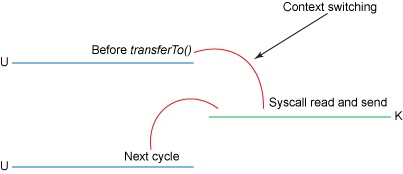

https://developer.ibm.com/zh/articles/j-zerocopy/

很多 Web 应用程序都会提供大量的静态内容，其数量多到相当于读完整个磁盘的数据再将同样的数据写回响应套接字（socket）。此动作看似只需较少的 CPU 活动，但它的效率非常低：首先内核读出全盘数据，然后将数据跨越内核用户推到应用程序，然后应用程序再次跨越内核用户将数据推回，写出到套接字。应用程序实际上在这里担当了一个不怎么高效的中介角色，将磁盘文件的数据转入套接字。

数据每遍历用户内核一次，就要被拷贝一次，这会消耗 CPU 周期和内存带宽。幸运的是，您可以通过一个叫 零拷贝 — 很贴切 — 的技巧来消除这些拷贝。使用零拷贝的应用程序要求内核直接将数据从磁盘文件拷贝到套接字，而无需通过应用程序。零拷贝不仅大大地提高了应用程序的性能，而且还减少了内核与用户模式间的上下文切换。

Java 类库通过 java.nio.channels.FileChannel 中的 transferTo() 方法来在 Linux 和 UNIX 系统上支持零拷贝。可以使用 transferTo() 方法直接将字节从它被调用的通道上传输到另外一个可写字节通道上，数据无需流经应用程序。本文首先展示了通过传统拷贝语义进行的简单文件传输引发的开销，然后展示了使用 transferTo() 零拷贝技巧如何提高性能。

# 数据传输：传统方法

考虑一下从一个文件中读出数据并将数据传输到网络上另一程序的场景（这个场景表述出了很多服务器应用程序的行为，包括提供静态内容的 Web 应用程序、FTP 服务器、邮件服务器等）。这个操作的代码大致如下：

```c
File.read(fileDesc, buf, len);
Socket.send(socket, buf, len);
```

这个代码表达的意思很简单，但实际上，拷贝的操作需要**四次用户模式和内核模式间的上下文切换**，而且在操作完成前数据被复制了四次。下图展示了数据是如何在内部从文件移动到套接字的：


下图展示了上下文切换


这里涉及的步骤有：

1. `read()` 调用引发了一次从用户模式到内核模式的上下文切换。在内部发出`sys_read()`以从文件中读取数据。直接内存存取（direct memory access，DMA）引擎执行了第一次拷贝，它从磁盘中读取文件内容，然后将它们存储到一个内核地址空间缓存区中。
2. 所需的数据被从读取缓冲区拷贝到用户缓冲区， `read()`调用返回。该调用的返回引发了内核模式到用户模式的上下文切换（又一次上下文切换）。现在数据被储存在用户地址空间缓冲区。
3. `send()` 套接字调用引发了从用户模式到内核模式的上下文切换。数据被第三次拷贝，并被再次放置在内核地址空间缓冲区。但是这一次放置的缓冲区不同，该缓冲区与目标套接字相关联。
4. `send()`系统调用返回，结果导致了第四次的上下文切换。DMA 引擎将数据从内核缓冲区传到协议引擎，第四次拷贝独立地、异步地发生。

使用中间内核缓冲区（而不是直接将数据传输到用户缓冲区）看起来可能有点效率低下。但是之所以引入中间内核缓冲区的目的是想提高性能。在读取方面使用中间内核缓冲区，可以允许内核缓冲区在应用程序不需要内核缓冲区内的全部数据时，充当 “预读高速缓存（readahead cache）” 的角色。这在所需数据量小于内核缓冲区大小时极大地提高了性能。在写入方面的中间缓冲区则可以让写入过程异步完成。

不幸的是，如果所需数据量远大于内核缓冲区大小的话，这个方法本身可能成为一个性能瓶颈。数据在被最终传入到应用程序前，在磁盘、内核缓冲区和用户缓冲区中被拷贝了多次。

**零拷贝通过消除这些冗余的数据拷贝而提高了性能**。

# 数据传输：零拷贝方法

考察传统方法中的步骤，其实第二次和第三次拷贝根本就是多余的。应用程序只是起到缓存数据并将其传回到套接字的作用而以，别无他用。数据可以直接从读取缓冲区传输到套接字缓冲区。 `transferTo()`方法就能够让您实现这个操作。`transferTo()`方法签名：

```java
public void transferTo(long position, long count, WritableByteChannel target);
```

`transferTo()`方法将数据从文件通道传输到了给定的可写字节通道。在内部，它依赖底层操作系统对零拷贝的支持；在 UNIX 和各种 Linux系统中，此调用被传递到`sendfile()`系统调用中，将数据从一个文件描述符传输到了另一个文件描述符：

- sendfile() 系统调用
```c
#include <sys/socket.h>
ssize_t sendfile(int out_fd, int in_fd, off_t *offset, size_t count);
```

- 使用 transferTo() 将数据从磁盘文件拷贝到套接字

```c
transferTo(position, count, writableChannel);
```

使用`transferTo`方法实现数据拷贝的内部过程：


使用 transferTo() 方法的上下文切换:



1. `transferTo()`方法引发 DMA 引擎将文件内容拷贝到一个读取缓冲区。然后由内核将数据拷贝到与输出套接字相关联的内核缓冲区。
2. 数据的第三次复制发生在 DMA 引擎将数据从内核套接字缓冲区传到协议引擎时。


改进的地方：我们将上下文切换的次数从四次减少到了两次，将数据复制的次数从四次减少到了三次（其中只有一次涉及到了 CPU）。但是这个代码尚未达到我们的零拷贝要求。如果底层网络接口卡支持 收集操作 的话，那么我们就可以进一步减少内核的数据复制。在 Linux 内核 2.4 及后期版本中，套接字缓冲区描述符就做了相应调整，以满足该需求。这种方法不仅可以减少多个上下文切换，还可以消除需要涉及 CPU 的重复的数据拷贝。对于用户方面，用法还是一样的，但是内部操作已经发生了改变：

1. transferTo() 方法引发 DMA 引擎将文件内容拷贝到内核缓冲区。
2. 数据未被拷贝到套接字缓冲区。取而代之的是，只有包含关于数据的位置和长度的信息的描述符被追加到了套接字缓冲区。DMA 引擎直接把数据从内核缓冲区传输到协议引擎，从而消除了剩下的最后一次 CPU 拷贝。


结合使用 transferTo() 和收集操作时的数据拷贝


