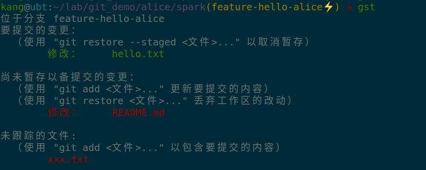

# 1. 为什么说git是分布式的

我们通过新建一个git仓库的例子来演示“git是分布式的”内涵。

> 由于演示需要涉及到多个用户，为了在一台电脑上模拟多个用户，我们建立一个目录`git_demo`,然后通过在这个目录下按用户的名字来建立子目录来表示不同的用户的工作空间。
>
> ```
> git_demo
> ├── alice
> ├── bob
> └── carol
> ```

## 新建一个项目

alice同学从无到有新建了一个项目

```bash
# 进入到自己的工作空间目录
cd alice

# 以项目的名字建立一个空的目录
mkdir spark

# 进入到spark目录，初始化git仓库
cd spark
git init

# 配置user.name和user.email
git config user.name alice
git config user.email alice@123.com

# 项目的第一个提交
echo "# This is project spark" > README.md
git add .
git commit -m 'add file README.md'
```

## 新成员的加入

bob同学对alice新建的项目很感兴趣，也加入了项目，那他怎么拿到alice的项目代码呢，当然是要`clone`了，从那里`clone`呢，需要alice告诉bob他新建的项目的"网络地址"

> git可以支持很多种协议，比如https，ssh，file等等，在这个例子中用一个电脑来模拟多个用户，最简单的就是用file协议

alice新建的仓库的地址是：

```bash
file:///home/kang/lab/git_demo/alice/spark
```

其实就是指向了alice的spark目录，如果是alice把spark目录放在一个可以通过https协议访问到的地方，那么，这个地址可能是这样的：

```bash
https://alice.site.com/spark
```

既然知道了alice的项目的地址，那bob就可以clone项目里：

```bash
# 进入到自己的工作空间目录
cd bob

# clone项目
git clone file:///home/kang/lab/git_demo/alice/spark

# 配置user.name和user.email
git config user.name bob
git config user.email bob@123.com
```

## alice和bob分别建立自己的功能分支并开发代码

### alice

```bash
# 建立自己的feature分支
git checkout -b feature-hello-alice

# 写代码
echo 'hello' > hello.txt

# 提交
git add hello.txt
git commit -m 'add file hello.txt'
```

### bob

```bash
# 建立自己的feature分支
git checkout -b feature-hello-bob

# 写代码
echo 'world' > world.txt

# 提交
git add world.txt
git commit -m 'add file world.txt'
```

## 如何共享代码

**在如何共享代码这一块就能体现出git的分布式内涵**

因为bob的仓库是clone自alice的仓库，在执行clone命令的时候，git已经自动把alice的仓库设置为bob的一个名为`origin`的远程仓库，这一点可以通过`git remote -v`命令看到：

```
kang@ubt:~/lab/git_demo/bob/spark(feature-hello-bob○) » git remote -v                     
origin	file:///home/kang/lab/git_demo/alice/spark (fetch)
origin	file:///home/kang/lab/git_demo/alice/spark (push)
```

所以，bob可以

### 1. 把自己的代码“push”到自己的远程仓库，也就是alice的仓库。

在此之前，查看下alice仓库的状态:

```bash
# 当前目录：alice/spark
git log --graph --all --decorate --oneline
```
输出

```
* 8ff39f4 - (HEAD -> feature-hello-alice) add file hello.txt (13 分钟前) <alice>
* 60e4fe6 - (master) add file README.md (28 分钟前) <alice>
```

bob执行push

```bash
# 当前目录：bob/spark
git push origin feature-hello-bob:feature-hello-bob
```

然后再查看alice仓库的状态，（命令如上）：

输出：

```
* 29cfbf9 (feature-hello-bob) add file world.txt
| * 8ff39f4 (HEAD -> feature-hello-alice) add file hello.txt
|/  
* 60e4fe6 (master) add file README.md
```

可以看到，alice的仓库多了bob刚写打代码，分支名是feature-hello-bob，而且对alice来说，是**本地分支**

### 2. 把alice的代码“fetch”到自己的仓库

> 注意，这里是“fetch”，不是“pull”

在此之前，查看下bob仓库的状态:

```bash
# 当前目录：bob/spark
git log --graph --all --decorate --oneline
```

输出：

```
* 29cfbf9 (HEAD -> feature-hello-bob, origin/feature-hello-bob) add file world.txt
* 60e4fe6 (origin/master, origin/HEAD, master) add file README.md
```

bob执行“fetch”

```bash
# 当前目录：bob/spark
git fetch origin
```

再次查看bob仓库状态：

```bash
* 29cfbf9 (HEAD -> feature-hello-bob, origin/feature-hello-bob) add file world.txt
| * 8ff39f4 (origin/feature-hello-alice) add file hello.txt
|/  
* 60e4fe6 (origin/master, origin/HEAD, master) add file README.md
```

可以看到bob的仓库多了feature-hello-alice分支，对bob来说这个分支是**远程分支**

## 互为远程仓库

从前面的例子中，可以看到，alice的仓库是bob的仓库的远程仓库，bob可以从alice的仓库“fetch”代码，也可以把bob自己的代码“push”到alice的仓库，看起来好像alice的仓库和bob的仓库有地位上的区别，其实不然，它们的地位完全是等同的，因为alice同样也可以把bob的仓库配置为自己的远程仓库：

```bash
# 当前目录：alice/spark
git remote add origin file:///home/kang/lab/git_demo/bob/spark
```

然后，alice就可以从bob处fetch bob的代码：

```bash
# 当前目录：alice/spark
git fetch origin
```

执行完之后，再看alice仓库的状态，也能看到bob的仓库状态体现在alice的仓库里：

```
* 29cfbf9 (origin/feature-hello-bob, feature-hello-bob) add file world.txt
| * 8ff39f4 (HEAD -> feature-hello-alice) add file hello.txt
|/  
* 60e4fe6 (origin/master, master) add file README.md
```

## 总结

n个人协同开发，git可以让每个人两两互为远程仓库，它们之间可以任意的互相“推拉”代码（不考虑权限问题）。


每个仓库的**地位都是对等的**，如果一个仓库文件损坏，完全可以从别的仓库恢复。

> 如果有部分代码只有损坏的仓库上有，那么这部分代码就丢失了

但是我们平常开发的时候都是围绕一个“中央仓库”来进行push和pull的，这是因为，如果完全按照上面互为远程仓库的模式，各个仓库之前不好同步状态，难以维护，技术不好也驾驭不了，所以我们还是会弄一个“角色”上的中央仓库，大家约定，都通过这个仓库来中转同步代码，但是这个所谓的中央仓库也只是“角色”上的中央仓库，而不是必要的技术实现上的中央仓库。一般这样的仓库是有像gitlab这样的软件来维护的，它不会“checkout”到某个分支上做开发，只接受其他人的push和fetch，这样的仓库一般设置为“纯仓库”，也就是设置"bare"为“true，`git config core.bare true`，这样的话，clone的时候，项目的地址一般是带个”.git“的后缀。


# 2. 常用命令

git的命令非常多，有100多个：

```
add                -- add file contents to index
am                 -- apply patches from a mailbox
apply              -- apply patch to files and/or to index
archimport         -- import an Arch repository into git
archive            -- create archive of files from named tree
bisect             -- find, by binary search, change that introduced a bug
blame              -- show what revision and author last modified each line of a file
branch             -- list, create, or delete branches
bundle             -- move objects and refs by archive
cat-file           -- provide content or type information for repository objects
check-attr         -- display gitattributes information
check-ignore       -- debug gitignore/exclude files
check-mailmap      -- show canonical names and email addresses of contacts
checkout           -- checkout branch or paths to working tree
checkout-index     -- copy files from index to working directory
check-ref-format   -- ensure that a reference name is well formed
cherry             -- find commits not merged upstream
cherry-pick        -- apply changes introduced by some existing commits
citool             -- graphical alternative to git commit
clean              -- remove untracked files from working tree
clone              -- clone repository into new directory
column             -- display data in columns
commit-graph       -- write and verify Git commit-graph files
commit             -- record changes to repository
commit-tree        -- create new commit object
config             -- get and set repository or global options
count-objects      -- count unpacked objects and display their disk consumption
cvsexportcommit    -- export a single commit to a CVS checkout
cvsimport          -- import a CVS "repository" into a git repository
cvsserver          -- run a CVS server emulator for git
daemon             -- run a really simple server for git repositories
describe           -- show most recent tag that is reachable from a commit
diff-files         -- compare files in working tree and index
diff-index         -- compare content and mode of blobs between index and repository
diff               -- show changes between commits, commit and working tree, etc.
difftool           -- show changes using common diff tools
diff-tree          -- compare content and mode of blobs found via two tree objects
fast-export        -- data exporter
fast-import        -- import information into git directly
fetch              -- download objects and refs from another repository
fetch-pack         -- receive missing objects from another repository
filter-branch      -- rewrite branches
fmt-merge-msg      -- produce merge commit message
for-each-ref       -- output information on each ref
format-patch       -- prepare patches for e-mail submission
fsck               -- verify connectivity and validity of objects in database
gc                 -- cleanup unnecessary files and optimize local repository
get-tar-commit-id  -- extract commit ID from an archive created using git archive
grep               -- print lines matching a pattern
gui                -- run portable graphical interface to git
hash-object        -- compute object ID and optionally create a blob from a file
help               -- display help information about git
http-backend       -- run a server side implementation of Git over HTTP
http-fetch         -- download from remote git repository via HTTP
http-push          -- push objects over HTTP/DAV to another repository
imap-send          -- send a collection of patches to an IMAP folder
index-pack         -- build pack index file for an existing packed archive
init               -- create empty git repository or re-initialize an existing one
instaweb           -- instantly browse your working repository in gitweb
interpret-trailers -- add or parse structured information in commit messages
log                -- show commit logs
ls-files           -- information about files in index/working directory
ls-remote          -- show references in a remote repository
ls-tree            -- list contents of a tree object
mailinfo           -- extract patch and authorship from a single email message
mailsplit          -- split mbox file into a list of files
merge-base         -- find as good a common ancestor as possible for a merge
merge-file         -- run a three-way file merge
merge-index        -- run merge for files needing merging
merge              -- join two or more development histories together
merge-one-file     -- standard helper-program to use with git merge-index
mergetool          -- run merge conflict resolution tools to resolve merge conflicts
merge-tree         -- show three-way merge without touching index
mktag              -- create tag object
mktree             -- build tree-object from git ls-tree formatted text
multi-pack-index   -- write and verify multi-pack-indexes
mv                 -- move or rename file, directory, or symlink
name-rev           -- find symbolic names for given revisions
notes              -- add or inspect object notes
pack-objects       -- create packed archive of objects
pack-redundant     -- find redundant pack files
pack-refs          -- pack heads and tags for efficient repository access
parse-remote       -- routines to help parsing remote repository access parameters
patch-id           -- compute unique ID for a patch
prune-packed       -- remove extra objects that are already in pack files
prune              -- prune all unreachable objects from the object database
pull               -- fetch from and merge with another repository or local branch
push               -- update remote refs along with associated objects
quiltimport        -- apply a quilt patchset
range-diff         -- compare two commit ranges
read-tree          -- read tree information into directory index
rebase             -- forward-port local commits to the updated upstream head
receive-pack       -- receive what is pushed into repository
reflog             -- manage reflog information
remote             -- manage set of tracked repositories
repack             -- pack unpacked objects in a repository
replace            -- create, list, delete refs to replace objects
request-pull       -- generate summary of pending changes
rerere             -- reuse recorded resolution of conflicted merges
reset              -- reset current HEAD to specified state
restore            -- restore working tree files
revert             -- revert existing commits
rev-list           -- list commit object in reverse chronological order
rev-parse          -- pick out and massage parameters for other git commands
rm                 -- remove files from the working tree and from the index
send-email         -- send collection of patches as emails
send-pack          -- push objects over git protocol to another repository
shell              -- restricted login shell for GIT-only SSH access
shortlog           -- summarize git log output
show-branch        -- show branches and their commits
show-index         -- show packed archive index
show-ref           -- list references in a local repository
show               -- show various types of objects
stash              -- stash away changes to dirty working directory
status             -- show working-tree status
stripspace         -- filter out empty lines
submodule          -- initialize, update, or inspect submodules
subtree            -- split repository into subtrees and merge them
svn                -- bidirectional operation between a Subversion repository and git
switch             -- switch branches
symbolic-ref       -- read and modify symbolic references
tag                -- create, list, delete or verify tag object signed with GPG
unpack-file        -- create temporary file with blob's contents
unpack-objects     -- unpack objects from packed archive
update-index       -- register file contents in the working directory to the index
update-ref         -- update object name stored in a reference safely
update-server-info -- update auxiliary information file to help dumb servers
upload-archive     -- send archive back to git-archive
upload-pack        -- send objects packed back to git fetch-pack
var                -- show git logical variable
verify-commit      -- check GPG signature of commits
verify-pack        -- validate packed git archive files
verify-tag         -- check GPG signature of tags
version            -- show git version
whatchanged        -- show commit-logs and differences they introduce
worktree           -- manage multiple working dirs attached to the same repository
write-tree         -- create tree from the current index
```

其中大部分我们都不需要用到，可能掌握最常用的20-30个左右就可以了，问题是很多常用的命令我们也经常用，也很简单，但是可能我们使用的仅仅是该命令的简化形式，而不了解改命令的完整形式。

我个人把git的命令分为3个层次：

1. 底层命令

   所谓底层命令，就是git内部使用的，一般和git内部的设计实现有关，比如`car-file`用于查看git底层的存储结构，一般开发过程中用不到

2. 基础原子命令

   所谓基础原子命令，就是“非组合命令”，比如“fetch“，”add", "commit"等

3. 组合命令

   所谓组合命令，就是说这些命令是由多个基础原子命令组合起来的逻辑，它们其实不是必须的，没有它们也可以完成git操作，只是它们的存在简化了git操作，本来要执行很多个命令才能达到的效果，执行一个组合命令就可以了。比如“clone”，“pull”。

>自定义命令：如果一段逻辑进场重复执行，我们可以自定义一个shell命令，实现“自定义命令”

## 2.1 git clone

clone其实很少用，基本只有在项目之初用一下，但是我曾经遇到过有的同学在远程仓库只不过换了个地址的情况下就不知道怎么办了，只好重新clone的场景。因此讲一下clone。它其实是个“组合命令”，可以用一些粒度更小的操作来替代实现。

接着前面的演示例子，如果一个新的名为carol的同学加入项目，他要加入项目，不用clone怎么得到自己的仓库呢？执行如下操作：

```bash
# 当前目录：carol/spark

# 1. 根据项目名新建目录
mkdir spark
cd spark

# 2. 初始化
git init

# 3. 设置远程仓库
git remote add origin file:///home/kang/lab/git_demo/alice/spark
# 其实名字不一定要是origin，可以取个更有意义的名字

# 4. 拉取
git fetch origin

# 5. 设置本地master分支跟踪远程的master分支
git checkout -b master origin/master
```

因此如果远程仓库换了地址，或者你有多个远程仓库，只需要用`git remote add`配置一个远程仓库，然后fetch其代码到本地即可。

## 2.2 git commit

git commit很简单，这里提到，是因为可能有初学者不知道`--amend`参数，在可以加`--amend`参数的时候尽量加上此参数，减少不必要的commit记录，保持git提交记录的干净整洁。

`--amend`参数可以把本次commit和上次commit合并为一个提交。

如果要把本次提交和前n次提交合并为一个提交，可以用 `rebase -i`,这个后面会讲到

## 2.3 git stash

git stash这个命令本身也比较简单，在任务完成到一半需要取到其他分支做临时任务的时候很有用。

## 2.4 git push

`git push`是一个极其常用的命令，但是很多初学者不知道的是，它是有很多参数的，只是不加参数的时候根据上下文环境使用了默认参数，有些时候我们是需要手动指定参数的，比如你有多个仓库，而你不想提交到默认的origin仓库，或者卸载配置文件里的仓库名。

`git push`的参数很多很多，也比较复杂，具体的可以看官方文档，这里只是稍比无参形式更进一步的介绍。

`git push`的相对完整形式是`git push <repo_name> <local_branch>:<remote_branch>`

`<repo_name>`是远程仓库的名字，不传的话就是origin，或者是当前所在的分支配置的一个值，总之就是如果不传，git会想办法得到一个默认值，这个值一般是”origin”

<local_branch>是本地分支名，<remote_branch>是远程分支名，一般这2个名字是一样的，并且就是等于当前所在的分支名，如果不满足这样的条件就要手动指定。

另外，当<local_branch>不传，但是写明<remote_branch>，表示要把远程仓库上的分支删除掉。

例如，把origin仓库的feature-xxx分支删除：

```bash
git push origin :feature-xxx
```

如果远程仓库状态很本地不一致，会导致push失败，这个时候可以加`--force`的标志强制覆盖，不过要慎重，除非明确知道自己在干什么。

## 2.5 git fetch

`git fetch`是把远程仓库和本地同步，这样在本地没有的内容，但是远程仓库上有的内容就会被下载到本地。`git fetch`仅仅做下载动作，而不做分支快进（rebase）或者分支合并（merge）。

`git fetch`可以下载一个仓库，也可以下载所有的仓库，也可以只下载指定分支，通过参数来指定。

- 不传参数，下载默认仓库所有分支，一般就是origin仓库

  ```bash
  git fetch
  # 等价 git fetch origin
  ```

- 加仓库名

  比如你在开源中国的码云上建立了个远程仓库并命名为gitee

  ```
  git fetch gitee

- 指定分支

  只下载某个仓库某个分支的代码

  ```bash
  git fetch origin feature-xxx:feature-yyy
  ```

  把远程仓库的feature-xxx拉取到本地，命名为feature-yyy分支


## 2.6 git cherry-pick

用一句话来理解`git cherry-pick`：你曾经提交过哪一个commit到git，git都已经记录在案，如果你像再次执行此动作，不需要重复执行你的动作，让git帮你重放。

比如，你辛苦的写完一个功能然后提交了，然后别人不小心把你的代码删了，你要重新找回你的代码，要怎么办？一种方法是“重新开发一遍”：checkout到但是提交的分支，把代码复制出来，重新提交。这是初学者采用的方法，更加简单的是用`cherry-pick`重放你的commit。

> cherry-pick可能失败，比如上下文环境已经发生了很大改变，有冲突，那么cherry-pick会提示冲突，需要解决冲突

## 2.7 git merge和git rebase

如果说`git cherry-pick`能重放一个commit，那么`git rebase`就是能重放**一条直线上的**多条commit。

`git rebase`这个命令很强大复杂，参数也很多，这里只讲解下开发过程常见简单使用场景，更加完整的使用可以参见官方文档。

### git merge以及merge的问题

假设，我们在某一个时刻，基于dev分支新建了feature-xxx分支，此时，dev分支最新的点是feature-xxx分支指向的点的“直接祖先”。

之后的一段时间，我们在feature-xxx分支上做了些开发，提交了几个commit，与此同时，dev分支有其他开发人员提交了代码，dev分支点已经前进，此时，dev分支最新的点**不是**feature-xxx分支指向的点的“直接祖先”，状态图如下：

```txt
                     A---B---C feature-xxx
                    /
               D---E---F---G dev
```

假设，我们继续在C点上开发，新写的功能要依赖于F点上提交的代码，或者干脆就是我们想同步最新的dev分支代码到feature-xxx分支，初学者的做法是用`git merge`命令把dev分支合并到feature-xxx分支：

```bash
# 当前分支feature-xxx
git merge dev
```

执行merge命令后，状态图就变为：

```
                     A---B---C---H  feature-xxx
                    /           /
               D---E---F------ G dev
```

此时，dev仍然指向G，而产生了新的提交点H，feature-xxx指向此，它是一个汇聚点。

将来，我们又基于feature-xxx做了2个提交:

```
                     A---B---C---H-----I------J feature-xxx
                    /           /
               D---E---F------ G dev
```

此时，我们在feature-xxx分支的功能开发完毕，要合并回dev分支，那么我们要在dev分支中执行“merge”

```bash
# 当前分支dev
git merge feature-xxx
```

命令执行完后，状态图变为：

```
                     A---B---C---H-----I------J feature-xxx
                    /           /				\
               D---E---F------ G ----------------K dev
```

产生一个新的节点K，dev指向此。

这个过程存在一个“合过来，又合过去”的动作，很不优雅。

一般的开源项目都是用rebase的方式来“同步dev分支的代码”，而不是用merge的方式。

> 什么时候用merge？比如从把dev分支合并到master
>
> ```bash
> # 当前分支 master
> git merge dev
> ```
>
> master分支作为重要分支，我们像“刻意保存”每一个合过来的点，这个时候就推荐用merge，不要rebase

### rebase的效果

还是回到这个状态：

```
                     A---B---C feature-xxx
                    /
               D---E---F---G dev
```

我们用rebase的方式，而不是用merge的方式把dev分支的代码同步到feature-xxx分支

```bash
# 当前分支feature-xxx
git rebase dev
```

命令执行后，状态图变成为：

```
                             A'--B'--C' feature-xxx
                            /
               D---E---F---G dev
```

A，B，C这3个点不复存在，但是它们背后所代表的动作依次基于最新的dev分支的G点进行了重放，得到3个新的点，A‘，B’，C'

这样feature-xxx和dev分支保持在一条直线上，而且也包含了最新的dev分支代码，接下来，feature-xxx分支做开发，dev分支同样前进，状态图变为：

```
                             A'--B'--C'----H-----I-----J feature-xxx
                            /
               D---E---F---G-----K-----L----M dev
```

此时的情形和最开始的类似，可以再次rebase，状态变为：

```
                                               A''--B''--C''----H'-----I'-----J' feature-xxx
                                             /
               D---E---F---G-----K-----L----M dev
```

feature-xxx始终基于最新的dev分支来做开发。在任何时候我们都可以在`feature-xxx`分支上执行`git rebase dev`以便把最新的dev分支代码同步到正在开发的分支。

> 如果有冲突，比如上面的H和L修改了同样的文件的同一块代码，那么rebase时会冲突，这个时候我们需要手动解决冲突，然后继续rebase。这个冲突不是因为rebase产生的，如果逻辑上有冲突，那么用rebase和merge都会冲突。
>
> 时刻rebase的另一个好处是，尽早的发现并解决冲突，因为越早发现冲突越小，越容易解决。上面的状态图里，假设H和L冲突，同时I和M冲突，那么在H的时候就执行rebase就可以发现并解决H和L的冲突，而不是等到在J点rebase的时候才发现H和L有冲突，同时I和M又冲突，而且2个冲突还有逻辑关系，导致陷入冲突的泥沼。

**养成习惯：在特性分支上，没事就可以`rebase dev`一下，反正又不要钱。**

### rebase -i

回到初始状态如下：

```bash
                     A---B---C feature-xxx
                    /
               D---E---F---G dev
```

假设我们发现A，B，C这3个提交太冗余了，它们合起来才做了一个很简单的事情，最好弄成一个提交就好了，理想的状态是：

```
                             W feature-xxx
                            /
               D---E---F---G dev
```

这个时候可以执行：

```bash
# 当前分支feature-xxx
git rebase -i dev
```

其中`-i`就是“交互”的意思，git会通过交互的方式让你选择把那些commit合并，或者是丢弃，甚至拆分等，看交互的对话框操作即可。

## 2.8 git pull

`git pull`这个命令是初学者误解最多的命令，针对初学者，它有2个方面的强调点：

1. `git pull`是一个组合命令

   `git pull`等于`git fetch` + `git merge` 或者是`git fetch` + `git rebase` ，至于具体是那一种，取决于配置的策略，默认是"merge", 我个人喜欢配置为"rebase"

   ```bash
   git config pull.rebase true
   ```

2. `git pull`的相对完整形式

   和`git push`类似

   ```bash
   git pull <repo_name> <remote_branch>:<local_branch>
   ```

   上面的参数其实都是`git fetch`这个命令需要的，按照`git fetch`的行为模式来理解就可以了，只是`git pull`在`fetch`成功之后多了一个合并代码的动作。

   假设当前本地仓库所在的分支是“feature-xxx”，执行命令`git pull`背后的逻辑是，先执行命令`git fetch origin feature-xxx：featrue-xxx`把origin仓库上的分支代码下载下来，然后合并到本地的“feature-xxx”分支，这个时候的策略如下：

   1. 如果可以快进，则快进合并
   2. 如果不可以快进，但是又没有设置必须强制快进，那么则merge
   3. 如果不可以快进，但是又设置必须强制快进，pull失败。

根据过往经验，一些同学通过一些git的GUI客户端（比如IDEA上的git菜单）取执行pull操作，但是没有太理解背后的逻辑，导致参数不太合理，从而导致生成的git提交记录非常的乱。举例。

## 2.9 其他常用命令

其他的常用命令，比如`git add`, `git branch`,`git tag`, `git checkout`, `git config`等都比较简单，操作也不太可能因为没有深入理解带来的操作不当导致git提交记录丑陋，就不一一细说了，参见官方文档就可以了。


# 3. 最佳实践

## 3.1 commit前用git status检查下状态

有的人经常误提交不应该提交的文件，或者遗漏要提交的文件。降低此类情况发生的方法当然就是在commit之前先检查一下状态，确认是不是有不该提交的文件或者遗漏的文件

`git status`的输出主要分3个部分：

- 已暂存
- 未暂存
- 未跟踪



## 3.2 简单的提交可以commit前用git diff检查下代码

`git diff --cached`可以检查下即将要commit的内容

## 3.3 commit或者push之后，用git log检查下状态，确认提交操作是否符合预期

使用命令`git log --graph --all --decorate --oneline`可以打印出图形化的提交记录拓扑图，检查下是不是该rebase的地方没有rebase？

这个命令比较长，可以设置一个别名：

```bash
alias glola="git log --graph --all --decorate --oneline"
```

这个命令的输出示例：


本地的分支是落后远程分支，还是领先远程分支，以及各个分支之前的拓扑关系，都可以看出来。

## 3.4 git blame查找作者

有时候我们发现一个bug，找到了涉及到的代码，想找作者了解下情况，一般的做法是到聊天群询问，其实可以用`git blame`找到每一个文件每一行代码的作者：

`git blame dev README.md`,可以查看dev分支上的README.md文件的每一行的最后作者是谁。更前一个提交的每行作者是谁：`git blame dev~1 README.md`

## 3.5 基于dev分支拉出feature分支后，经常性的rebase下

这一点在前面讲解rebase时有提到，这样可以时刻保持和最新的dev同步，并尽早将可能发生的冲突扼杀于摇篮，而不是等到提交合并请求的时候才发现冲突。不过需要注意的时，自己个人全权控制的分支可以rebase，如果rebase会对他人造成影响就不能rebase了。

# 4. GUI说明

我个人是不怎么用GUI客户端的，能用命令行的都用命令行，因为命令行更加本质，实际上GUI客户端点击按钮的背后也是执行命令，使用GUI的前提最好是你知道你点击一个按钮的背后都执行了啥命令。这样不至于你点击了一个按钮，结果执行的结果不符合你的预期，而你却不知道为什么。

> git使用不好的人甚至都不知道他自己的预期是什么，初学者都不指导merge和rebase的区别，更不论期望的是merge的效果还是rebase的效果了。

这里针对最常用的场景做一个GUI操作说明。

场景：基于develop拉取了feature-xxx做开发，现在要用**rebase的方式**合并最新的develop分支代码到feature-xxx分支，用IDEA的git菜单应该怎么做？

- 第一步，保证当前分支是feature-xxx分支：

  点击IDEA窗口右下角的git分子按钮

  

- 第二步，右键选择git菜单，fetch远程的develop分支

  

- 第三步，右键选择git菜单，用GUI操作执行rebase

  

注意要rebase到的基点是远程的develop，就是图中选的"origin/develop"，本地的develop也应该时刻保持和远程的develop同步，可以当前分支是develop分支的时候也执行上面动画的操作。

**强调：使用rebase的方式变基到`origin/develop`分支，不要点击pull按钮**

# 5.附

## 官方文档链接地址

本文档没有很详细的罗列很多命令的参数和用法，只是针对碰到过的一些初学者的问题做了稍加深入的说明，其实离掌握好git还很远，有需要的后续可以继续再补充和完善文档。

官方文档链接地址: https://git-scm.com/docs

## git原理简介

不做重点讲

### 1. 快照，而不是补丁

Git和其他版本控制系统的主要差别在于,Git只关心文件数据的整体是否发生变化,而大多数其他系统则只关心文件内容的具体差异。这类系统(CVS,Subversion,Perforce,Bazaar 等等)每次记录有哪些文件作了更新,以及都更新了哪些行的什么内容：


演示：补丁的生成，应用补丁，撤销补丁

```bash
# 新建文件a.txt和b.txt
echo "hello" > a.txt
cp a.txt b.txt
echo "world" >> b.txt

# 生成补丁
diff a.txt b.txt > a-b.patch

# 应用补丁到a.txt： a.txt --> b.txt
patch a.txt a-b.patch

# 从b.txt撤销补丁： b.txt --> a.txt
patch -R b.txt a-b.patch
```

Git并不会保存文件前后变化的差异数据（也就是补丁），而是把变化的文件作快照后，记录在一个微型的文件系统中。每次提交更新时，它会纵览一遍所有文件的指纹信息并对文件作一次快照，然后保存一个指向这次快照的索引。为提高性能,若文件没有变化,Git不会再次保存,而只对上次保存的快照作一链接：


这是Git同其他系统的重要区别。它完全颠覆了传统版本控制的套路,并对各个环节的实现方式作了新的设计。Git更像是个小型的文件系统,但它同时还提供了许多以此为基础的超强工具,而不只是一个简单的VCS。

什么是“快照”？


如上图，假设我们在v1目录下写毕业论文，然后我们将v1目录复制为目录v2,然后修改了其中的部分文件。那么v1这个目录就是一个“历史快照”。采用复制的方式保存快照，有一个显然的问题：没有修改的文件也会复制一份，会占用额外的存储空间。怎么解决呢，一个可以想到的办法是做软链接。

### 2. Git对象

Git中有3种类型的对象：

- blob: 用于存储文件的内容，可以类比为操作系统上的文件;
- tree: 可以含有其他的多个tree或者多个blob，可以类比为操作系统上的目录, 目录下可以有多个子目录，多个文件;
- commit: 把顶层的tree，做一次快照，就好比把一个目录复制一份作为备份。


所有的对象Git都以文件的形式保存在`.git/objects`目录中。

我们新建一个目录。执行git初始化：

```bash
mkdir simple
cd simple
git init
tree .git/objects
```

会看到输出：

```txt
.git/objects
├── info
└── pack
```

只有2个空的目录：info，pack，其作用先不管，忽略之。

新增一个文件并提交, 然后再次看`.git/objects`目录的内容：

```bash
echo "hello" > a.txt
git add .
git commit -m 'add a.txt'
tree .git/objects
```

输出：

```txt
.git/objects
├── 2e
│   └── 81171448eb9f2ee3821e3d447aa6b2fe3ddba1
├── 3b
│   └── 2c3387c59ff0df98e04ce8c8f9c8eb3e940073
├── ce
│   └── 013625030ba8dba906f756967f9e9ca394464a
├── info
└── pack
```

可以看到多了3个文件。Git中每一个对象，不管是blob，还是tree，抑或是commit，都可以用一个40个字符长度的SHA-1哈希值来指代。为了不让obejcts目录下的文件过多，Git取这40个字符的前2个作为目录，后38个字符作为文件名。

为了要查看这些文件的内容，需要用到一个底层的Git命令`git cat-file`， 可以加`-t`输出对象类型，`-p`输出对象内容.

这里我们用一个简单的工具脚本来以文本形式展示各个对象文件的类型和内容：

```bash
#!/bin/bash

GIT_PRO_ROOT=$1
OUTPUT_FILE=$2

cd "$GIT_PRO_ROOT"/.git/objects || exit 1

HASH_PREFIX_ARR=$(ls)

for HASH_PREFIX in $HASH_PREFIX_ARR;
do
    HASH_LEFT_ARR=$(ls "$HASH_PREFIX")
    for HASH_LEFT in $HASH_LEFT_ARR;
    do
        HASH="${HASH_PREFIX}${HASH_LEFT}"
        {
            echo -e "HASH = $HASH"
            echo -e "TYPE = $(git cat-file -t "$HASH")"
            echo "-----"
            git cat-file -p "$HASH"
            echo -e "\n\n==========================================="
        } >> "$OUTPUT_FILE"
    done
done
```

用这个脚本来分析刚刚新建的`simeple/.git/objects`目录的内容，可以得到大致如下的输出：

```txt
HASH = 2e81171448eb9f2ee3821e3d447aa6b2fe3ddba1
TYPE = tree
-----
100644 blob ce013625030ba8dba906f756967f9e9ca394464a    a.txt


===========================================
HASH = 3b2c3387c59ff0df98e04ce8c8f9c8eb3e940073
TYPE = commit
-----
tree 2e81171448eb9f2ee3821e3d447aa6b2fe3ddba1
author 邹康60456 <60456@sangfor.com> 1609232941 +0800
committer 邹康60456 <60456@sangfor.com> 1609232941 +0800

add a.txt


===========================================
HASH = ce013625030ba8dba906f756967f9e9ca394464a
TYPE = blob
-----
hello


===========================================
```

各个hash值之间有关联关系，逻辑上可以形成数据结构中的`树`结构。可视化的展示的话就和前面的图一样。

我们再2次修改和提交：

```bash
echo "world" >> a.txt
git add .
git commit -m 'update a.txt'

echo "good" > b.txt
git add .
git commit -m 'add b.txt'
```

更新了a.txt,然后有新增一个文件b.txt, 再次看`.git/obejcts`目录的话。可以看到又多出一些对象文件。构成如下的逻辑关系：


### 3. 引用

在各种git命令中直接使用hash值也是可以的，但是hash值不易读，也不易于记忆，于是就需要为hash值取一个”别名“，也就是引用，这个其实就是”分支“的本质：分支本质上就是一个hash的别名，新建分支就是为一个hash新建一个别名，多个分支指向同一个commit，本质就是一个hash有多个不同的别名，在Git中新建一个分支的代价是很低的（在SVN中有较高代价）。

引用的维护就是用文本文件维护的，在`.git/refs`目录中，git初始化后，默认会建一个master分支，这一点可以从`.git/refs`目录中看到:

执行`tree .git/refs`输出：

```txt
.git/refs
├── heads
│   └── master
└── tags
```

查看master内容， `cat .git/refs/heads/master`, 输出一个40字符长度的hash值。

如果们新建一个分支，则会看到heads目录下多出一个和分支名同名的文件，文件的内容是分支指向的hash。

另外还有一个特殊的引用`HEAD`，它不在refs目录下，而是直接在`.git`目录下，他指向的是当前检出的分支，执行`git checkout master; cat .git/HEAD`, 可以看到输出`ref: refs/heads/master`, HEAD不仅可以执行分支，也可以直接指向一个hash，比如，我们先直接checkout到一个hash：`git checkout 3db0add`, 再执行`cat .git/HEAD`查看其内容，则会看到输出一个40位的hash值。
