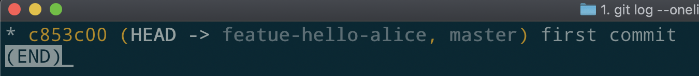
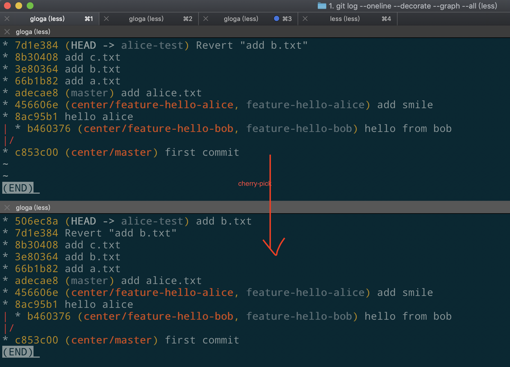

## 0x00 前言

Git是一个分布式的版本控制系统，深入理解并掌握好Git的玩法之后，可以"把代码玩弄于股掌之间"。很多人虽然在项目中使用Git，但是却把Git按照Svn的玩法玩，完全没有发挥出Git的强大功能，每天做的操作仅仅限于"git commit”, "git pull", "git push"这几个基本操作，背后的“树”乱78糟：无效的commit一大堆，依赖关系错综复杂。

知名的开源项目的commit树一般都是井井有条的，看起来非常的舒服。

例如cpython的commit树部分截图：


可以看到3.6版本，3.7版本，和当前master各自都是一条笔直的线，整个项目各个版本之间的依赖关系井井有条，看起来很舒服。

再看看我们项目的提交树：

- todo

对于一个提交来说，可以感受到这样的心态：反正代码我是提交了，我写的功能上库了，背后毫无代码管理和维护意识。

## 0x01 玩好Git之我见

我自己在使用Git时有一套既定的规则，而我本人就是执行这些规则的程序，最终的目的就是尽量让我自己的提交不会让项目的Git树更加的混乱（其他人我就无能为力了）。当然，这些都是基于我自己对于Git的理解，可能不完全正确，也不会符合所有人的习惯，仅做分享，择优而取。

使用Git的内功心诀就是：

- **心中有树，树在心中**

什么意思呢？Git背后所有的提交，构成从一个点长出来的树，通过一条或者多条命令，我们可以改变这个树的状态，那么我们准备要提交一段我们刚写好的代码了，在这之前，我会思考3件事情：

1. 当前这个树长啥样
2. 我想让这个树在我提交之后变成啥样
3. 我该使用什么命令让这个树变成我想让他变成的样子

考虑好3件事情后就执行既定的命令，达到自己的目的。

要理解这些，得会一些除了"git commit"， "git push"等这些命令之外的其他命令，以及对Git稍深的理解。

下面我们从头开始，通过故事和模拟项目的形式讲一下我对Git的理解。

## 0x02 理解Git的分布式

Svn是集中式的版本控制系统，而Git是分布式的，什么是分布式，如何理解它所代表的内涵，我们通过故事的形式来理解。

### 1 伟大的项目诞生了

有一天，一个名字叫Alice的同学，决定写一个伟大的项目，名字取好了，叫spark

于是，Alice同学建立了一个目录。

Alice同学在"/User/zk/git-repo"这个目录下建立了一个以自己的名字命名的目录Alice，然后又在Alice目录下建立的spark目录。

*（以后我们还会有其他的同学出场，比如Bob同学，Carl同学，这些同学本来应该有自己的电脑，然而因为我们是模拟，本人只有一台电脑，所以，以后会在/User/zk/git-repo目录下建立以其他同学的名字为名的目录来当作其他同学的电脑）*


然后在spark目录下，执行

`git init`

初始化了一个项目。

Alice知道，建好了项目之后，在进行任何提交之前，应该设置好"user.name"和"user.email"，方便以后出了惊天大bug后分配黑锅。

```bash
git config user.name alice
git config user.email alice@spark.com
```

*（因为同一个电脑，我们要模拟多个同学，这里不配置全局的user.name和user.email）*

配置好了后，Alice同学写了一个文件readme.md

```bash
echo "this is project spark" > readme.md
```

然后Alice执行如下命令，提交了这个文件

```bash
git add .
git commit -m "first commit"
```

Very good！spark项目有了第一个提交，目前的树就只有一个提交，它将是以后所有提交的祖先：


伟大的项目都是从"Hello World"开始的，Alice决定先来个Hello World练练手。

Alice深知，使用Git，不应该在master分支上乱搞，于是Alice新建了分支"feature-hello-alice":

```bash
git checkout -b "feature-hello-alice"
```

建好分支后，Git的树长这样：



可以看到，多了一个分支，也指向hash为"c853c00"（开头）的提交。

在Alice的spark目录，Alice执行

```bash
vim hello.py
```

准备用自己最喜欢的编辑器之神Vim，以及自己最喜欢的编程语言python，来一个Hello World：

```python
#!/usr/bin/env python
# coding=utf-8

def hello_alice():
		print "hello alice"

```

搞定之后，Alice，提交了代码：

```bash
git add .
git commit -m "alice hello"
```

提交之后：


可以看到，分支feature-hello-alice向前进了一步，领先master一个commit

### 2 新成员加入

Bob同学听说Alice同学建立个伟大的项目，很感兴趣，表示想尽绵薄之力，Alice同学欣然同意。Alice同学说我的项目地址是：`ssh://zk@zk-mkp:22/Users/zk/git-repo/Alice/spark`

Bob你用clone命令检出代码吧。

*(需要使用用户名zk通过ssh登录到主机zk-mkp，这里其实就是本机的一个目录，模拟远程效果)*

于是Bob在自己的电脑上(就是目录/Users/zk/git-repo/Bob)，新建目录，clone代码，一气呵成：


Bob克隆完代码后，照样设置了自己的名字和邮件：


其实在Bob按照Alice给的地址clone了Alice的代码之后，Alice的代码仓库就是对于Bob来说就是一个远程仓库了，并且，在Bob的电脑上的spark项目，自动为Alice的代码仓库起了一个名字来代表它，这个名字就是`origin`


Bob在自己的电脑上修改了代码之后，可以push到Alice的代码仓库。

Bob拿到代码之后，也决定先来一个Hello World

于是Bob基于master分支建立了分支"feature-hello-bob"

```bash
git checkout master
git checkout -b feature-hello-bob
```

Bob建好分支后，对于Bob来说，它的commit树目前长这样了：


可以看到，对于Bob来说，有个远程分支feature-hello-alice在名为origin的仓库中，本地也有个feature-hello-alice分支用来跟踪它。刚刚新建的分支feature-hello-bob只在本地有。

建好分支后，Bob开始了Hello World，bob新建了个文件hello_bob.py，写了点代码：

Bob在hello_bob.py中加了个hello_bob函数：

```python
#!/usr/bin/env python
# coding=utf-8

def hello_bob():
		print "hello bob"

```

然后提交。

```
git add .
git commit -m "hello from bob"
```

Bob提交之后，Bob的commit树长这样：


Bob的树有了分岔点，因为Alice和Bob都基于master分支写了代码，然后做了提交，是并行的开发。

Bob的代码写完了，也提交到了自己的分支。这时，Bob迫不及待的想跟Alice分享自己的代码，于是，Bob决定使用push命令，将代码push给Alice，在push之前，要搞明白这3点：

- 我要push的是本地的那个分支
- 我要push到的远程仓库的名字
- 我要push到远程仓库的那个分支

显然，Bob想push的本地分支为feature-hello-bob，要push的远程仓库的名字为origin，push到远程的那个分支呢，这个一般就是跟本地分支同名，不同名可不可以？可以！但是这就是自己给自己找不愉快。

好了，既然3点都想明白了，命令也确定了：

```
git push origin feature-hello-bob:feature-hello-bob
```

执行之。

执行完了之后，Alice就可以看到Bob的代码了：


### 3 分享代码

在Alice同学把仓库地址给了Bob同学之后，在Bob同学为项目添砖加瓦的同时，Alice同学也没有闲着啊，Alice同学把他的hello_alice函数修改了下，加了笑脸和感叹号，丰富下情感：

```python
#!/usr/bin/env python
# coding=utf-8

def hello_alice():
		print "hello alice ^-^ !!"
```

Alice同学很快就改好了，并且提交到了自己本地的feature-hello-alice分支：

```
git add .
git commit -m "add smile"
```

此时，Alice的commit树长成这样：


Alice写完之后，也想把代码分享给Bob，怎么办呢，一个办法是让Bob来拉Alice的代码，因为Alice的代码仓库就是Bob的远程仓库，只要Bob执行下面的命令，就可以把Alice有的代码，但是Bob没有的都拉取到Bob的本地：

```
git fetch origin
```

可是Alice就是想主动的推给Bob，不要Bob来拉取，怎么搞？这需要把Bob的仓库配置为Alice的仓库的远程仓库，于是Alice询问了Bob的仓库地址，Bob告诉Alice，地址是：

```bash
ssh://zk@zk-mkp:22/Users/zk/git-repo/Bob/spark
```

好了，Alice知道了地址，于是Alice把这个地址设置为自己的一个远程仓库，并取名为bob

```
git remote add bob ssh://zk@zk-mkp:22/Users/zk/git-repo/Bob/spark
```

执行之后，可以用"git remote"查看：


OK～了，现在Alice可以主动推代码给Bob了，Alice执行了下面的命令：

```bash
git push bob feature-hello-alice:feature-hello-alice
```


现在如果Bob查看自己的Commit树，将会是如下这样：


可以看到，Bob的仓库有了Alice的最新代码

### 4 分布式

Alice可以推代码给Bob，也可以从Bob那里拉取代码，同样的，Bob可以推代码给Alice，也可以从Alice那里拉代码。也就是说Alice和Bob的代码仓库**没有地位上的区别**，没有主从关系，也没有客户端和服务端的关系，它们都能够代表这个项目。如果Alice的电脑进水了，代码丢了，不要紧，Bob那里还有，Alice可以从Bob那里恢复，反过来也一样。**这就是分布式**

假设后来又有个新同学Carl也加入了这个伟大的项目，Carl从Alice或者Bob那里clone代码都可以。如果Alice，Bob，Carl这3个同学都把除了自己以外的另外2个同学的仓库设置为自己的远程仓库（当然，不同的远程仓库要取不同且好记又好区分的的名字），那么他们3个就可以互相之间随便推，随便拉了。


但是这也太自由了，其实容易出问题，比如如果Alice当前正检出着feature-hello-alice分支，此时，Carl同学觉得Alice同学的代码有点问题，于是carl就在feature-hello-alice分支上帮Alice改了，然后推给了Alice，这时Carl会推失败，因为这次推送会改变Alice当前正检出分支的状态，如果Alice当前不在feature-hello-alice分支，Carl的这次推送就没问题。

这个问题只是一个例子，还好解决，互相之间知会一声，让Alice先别停在自己的feature-hello-alice分支上，或者配置Git允许本地正被检出的分支被覆盖。

这种任意2个仓库之间都可以推拉的模式下，很可能会出现各个开发人员掌握的信息不一致，出现各种各样的冲突。而且，虽然对于Git命令来说，Alice，Bob，Carl等同学的仓库其实是没有地位区别的。但是，任意2个仓库之间推拉结构也不清晰。为了有个更加清晰的仓库关系结构，我们可以人为的规定，某个仓库作为"服务仓库"，其他仓库都只能和这个服务仓库推拉，而不能抛开了"服务仓库"来私下偷摸来往。

于是，Alice，Bob，Carl决定在一个单独的机器上建立这么一个服务仓库，取名为"center"。这个center仓库相比于Alice，Bob的仓库，从用途上来讲，还是有些不同的：

- center仓库不会主动去推送代码到别的仓库，而是由别的仓库来拉取
- center仓库不会主动去拉取别的仓库的代码，而是由别的仓库来推送
- 正是因为前2点，center仓库也并不需要检出一个目录

这样的仓库我们叫"纯仓库"

建立这个名为"center"的"纯仓库"的任务叫给了Alice

Alice找了台机器（目录/Users/zk/git-repo/center），然后在这台机器上检出了自己仓库的代码。

在clone的时候，Alice加了"--bare"的参数，这样，就会clone出一个**"纯仓库"**


可以看到，加了"--bare"参数clone出来的"纯仓库"和一般的Alice和Bob的工作仓库有点不同，它的目录名字自动加了`.git`作为后缀。

这个仓库建好了，地址也确定了：

```bash
ssh://zk@zk-mkp:22/Users/zk/git-repo/center/spark.git
```

Alice, Bob, Carl都用"git remote remove"命令取消了设置另外2人的仓库为自己的远程仓库，然后都执行

```
git remote add center ssh://zk@zk-mkp:22/Users/zk/git-repo/center/spark.git
```

将center仓库设置为自己的远程仓库

现在的结构可以用下图来表示：


这就是平时我们用的模式了，公司有个服务器存放着代码，作为中央纯仓库，我们每天的工作就是提交代码到这个中央纯仓库。

## 0x03 心中有树

理解了Git的分布式内涵之后，有利于我们再学习其他的命令，可以按自己的想法将Git的commit树操纵于股掌之间。

现在，有3个仓库了，我们先让Alice和Bob都fetch一下center，让Alice和Bob的代码和center同步。（其实现在代码是同步的，只是Alice和Bob的仓库还不知道center上有哪些分支，我们需要fetch一下）

```
git fetch center
```

执行完后，查看3个仓库的状态，如图：


从现在开始，Alice和Bob要正式的开始开发了。

Alice在开始其他开发工作之前，决定要把自己单独负责开发的feature-hello-alice合并到master分支，Bob也是，他也决定要把自己单独负责开发的feature-hello-bob分支合并到mater分支。

我们假设，Alice先执行了合并。

Alice要把feature-hello-alice合并到master分支，Alice执行的命令是：

```bash
# 当前分支：master
git merge feature-hello-alice
```

执行后：


Alice的Git树的拓扑结构并没有变化，只是master分支变了个位置，和feature-hello-alice分支指向了同一个commit

这种情况我们称为**快进**

这是因为当前分支master是要合并进来的分支feature-hello-alice的直接祖先，在种情况下，merge的默认行为是执行一个快进动作。

如果我们所有的merge都能只执行一个快进动作就完成，那么我们的树就是一条没有分叉的直线，这种树看起来最清爽，最简单。

假设当前分支并不是要被合并进来的分支的直接祖先，那么，merge操作会怎么样呢。

Alice决定做个实验：

Alice基于"c853c00"新建个分支：

```bash
git branch alice-test c853c00
git checkout alice-test

# 或者 git checkout -b alice-test c853c00
```


分支建好后，其实只是多了个"分支名"指针，指向了某个提交。

Alice在分支alice-test分支上随便写点东西（不要冲突）

然后提交：

```bash
# 当前分支： alice-test
echo "test" > alice.txt
git add .
git commit -m "add alice.txt"
```

执行后：


可以看到，master分支不是alice-test的直接祖先了。

这时，我们切换到master分支后，再合并alice-test分支到master分支看看：

```bash
git checkout master
git merge alice-test
```


可以看到，执行merge前和执行merge后，树的拓扑结构发生了变化，多了一个自动产生的提交"5164513"，这种就不是快进。

而且，Git树不是一条线，而是有分叉，我们以有多少列来算"并行度"的话，这个"并行度"是2

我个人遵循的一条最佳实践是：

- **尽可能的减少Git树看起来的并行度**

尽管有些时候，并行度的增加无法避免，不管是需求上的还是技术上的，但是如果能减少这个""并行度"的时候，就减少这个并行度。

虽然目前我们这个就只有2条线，看起来结构也还清晰，但是随着项目的扩大，开发的人越来越多，如果没有这种减少并行度的意识，日积月累的我们的"并行度“就会越来越高。Git树太乱了的话，其实有时是会影响我们对代码的管理的。如果我们每次都有这种意识，刻意的去减少这个“并行度”，那么我们的树就不会长的很离谱，说不定再将来我们会因此而受益。

怎么减少这个并行度？秘诀就是：

- **经常rebase**

### 1 rebase

那么什么是rebase？

还是前面的例子，Alice在把alice-test分支合并到master分支的时候，不应该用merge，而是应该用rebase，为了看这个rebase的效果，我们先撤销这个合并，把master分支强行再指向合并之前的提交"456606e"

```bash
# 先离开master分支
git checkout alice-test
# 强制设置master指向456606e
git branch -f master 456606e
```

执行完成后就回到了合并之前的状态：


这时，我们使用先使用rebase

```bash
git checkout alice-test
git rebase master
# 或者，2条命令合为一条：git rebase master alice-test
```

执行完成后：


可以看到，hash为"56b1804"的提交没有了，取而代之的是多了一个hash为"adecae8"的提交，而且这个提交和master是在一条线上，没有分叉，现在master是alice-test分支的直接祖先了。如果此时我么再执行merge

```bash
git checkout master
git merge alice-test
```


看吧，现在只通过**快进**我们就合并了代码。而且合并后我们的代码只有一条线（暂时不考虑Bob的代码，Bob的代码也可以合到一条线进来）

rebase字面意思我理解为"变基"，（有的书高深莫测，解释为衍合，咋一听很高大上，不知道啥意思），"变基”就是把一个提交（或者一段在一条线上的连续提交）从一个“基”变到另一个“基”

1. hash为"56b1804"的提交的"基"是"c853c00"
2. hash为"adecae8"的提交的"基"是"456606e"

rebase的操作就是把hash为"56b1804"的提交所代表的操作（这个操作就是加了个alcie.txt文件）基于"456606e"做了一次"重放"，产生了一个新的commit "adecae8" ，然后删除了之前的commit "56b1804"

再次重申：

- **如果可以的话，我们应该经常rebase**

不可以的情形另当别论，例如，rebase之后会引入我们目前还不想要的代码，可以暂时不rebase，等时机成熟的时候再rebase，或者不方便rebase（代码已经push到远程，已经被共享），那就不用rebase。

假设我们基于master分支新建了一个分支开发，我们应该假定，远程的master分支随时都可能已经更新，然后就领先于了我们本地的master，这时我们可以的话，就执行

```bash
git checkout master
git pull origin master:master
git rebase master my-branch
```

确保：

	1. 本地的master尽快的和远程的master保持同步
 	2. 我们正在开发的特性分支总是基于最新的master，在合并到master的时候，可以用快进来实现
 	3. rebase可能有冲突，在rebase的时候，我们就可以立马在本地解决，而不是等到push到远程的时候才发现冲突

这个动作我们应该经常就执行一下，因为这一刻我们执行之后同步了，下一刻就可能有其他人的代码合并到了远程master。

rebase还有更复杂的用法，具体可以通过"git help rebase"查看，这里主要是灌输一种使用rebase的意识，思想，以及最佳的实践。

### 2 追求更好的树

通过前面对rebase的一个使用，我们知道，我们是可以对Git背后的commit树进行改造的，我们应该最求更清晰，更简单的树的结构，而不是写好代码就"git commit"，然后"git push"完事。

很多人使用Git，基本的命令也会用，但是**没有一种追求更好的树的意识**，Git有一些前人总结出个各种Flow（工作流），我认为，这些都是一种一种追求更好的树的意识的体现和总结。

如果没有这种**心中有树**：**追求更好的树的意识**，就不会去想目前的树有什么问题，怎么去优化。

## 0x04 如何查看树

为了追求更好的树，我们首先要知道如何查看树的状态，做到对当前的树处于什么样的状态了然于胸。可以思考的问题有很多，（举例）：

- 我目前处于那个分支上

- 我目前的分支是做什么功能的，依赖于其他的分支吗

- 我目前的分支跟本地的master分支是什么拓扑关系

- 本地的master是否已经落后于远程的master，是否有必要立即和远程的master同步

- 我有需要基于master或者别的什么分支进行rebase的分支吗

- 如果我同时在多个分支上做贡献，它们分别有什么样的依赖关系

- 如果有多个远程仓库的话，它们目前都处于什么状态，我依赖的别人的代码上苦了吗

- 我的暂存（stash）栈目前是什么状态，暂存了那些代码？

- 我目前本地的提交中有无效的提交吗，有可以合并，或者需要拆分的提交吗

- …...

查看树的状态的命令主要有3个：

- git status
- git log
- git show
- git diff

下面我们分别讲一下：

### 1 git status

`git status`可以说是git里面差不多最简单的几个命令了，平时使用时也几乎不太需要加其他的控制参数，**时不时经常`git status`一下是一个好习惯**，应该融入骨髓，像写代码是习惯Crtl+S一样。

当敲出"git status"，然后看到了如下一句话

```nothing to commit, working tree clean```

会有一种轻松的感觉。

如果当前有文件改动，会看到类似如下的输出：


改动主要分成了3类：

- 已stash的改动
- 还未stash的改动
- 没有跟踪的新文件

**在准备提交代码之前，git status一下是一个好习惯，确认即将要提交的文件确实是我们要提交的**

有时无意中多了一个没必要的改动，又或是缺失了一个以为已经以为的改动，也是常会发生的事。

在git status确认好我们要改动的文件，既不多，也不少后，我们最好还使用`git diff --cached`确认一下改动的内容。


可以看到，我们目前暂存的改动中，都有哪些行是新加的，哪些行是删除的。

**在准备提交代码之前，`git diff —cached`一下是一个好习惯，确认即将要提交的内容确实是我们要提交的**

经常执行，你可能会发现：

- 咦？我这里少了个分号？
- 嗯？我这里注释居然写了个错别字！
- 喔，这个文件的换行符不对啊，后面怎么有个`^M`

***别名推荐***

```bash
# 既然 git status经常要敲，那定义个别名吧
alias gst='git status'
```

### 2 git log

**`gloga`**是我个人最常用，敲得最多的命令，没有之一。我会时不时机械的就想gloga一下以便了解最新的仓库状态。

当然，这是一个别名：

***别名推荐***

```bash
# 常用git log别名
alias glog='git log --oneline --decorate --graph'
alias glol='git log --graph --pretty='\''%Cred%h%Creset -%C(yellow)%d%Creset %s %Cgreen(%cr) %C(bold blue)<%an>%Creset'\'' --abbrev-commit'
alias gloga='git log --oneline --decorate --graph --all'
alias glola='git log --graph --pretty='\''%Cred%h%Creset -%C(yellow)%d%Creset %s %Cgreen(%cr) %C(bold blue)<%an>%Creset'\'' --abbrev-commit --all'
```

**gloga**执行效果：


gloga可以分页看到整个commit树的拓扑结构，以图形可视化的形式将拓扑结构展示出来，每个分支分别指向那个点，什么先后依赖关系，等等。前面的截图多半都是这个命令执行来的。

glog的信息比glog少点，只会列出当所在点的祖先，它的子孙以及和这个点关系不大的其他提交不会展示，在我们只关注当前状态，不关心全貌时可以使用：


glola的信息比glog要多点，除了有glog包含的信息，还会显示时间信息，以及作者信息。让我们对提交的时间关系以及作者有个了解：


使用gloga查看了树的拓扑图后，便可以思考：

- 我这个提交提交到这里是对的吗
- 我的提交可以整理优化吗
- …..

### 3 git show

使用gloga可以看到commit树的拓扑，同时也可以看到每个commit的hash，这时，如果我们在其中找到了某一个我们关心（比如我们怀疑这个commit导致了bug）的commit，那么我们可以`git show`查看一下这个commit

比如，Alice想看下 8ac95b1 这个commit改了些啥，我们可以执行`git show 8ac95b1`


git show一个commit可以看到在该commit中有哪些文件被修改，以及每个文件加了哪些行，又删除了哪些行。

git show 加commit的hash将会展示该commit所修改的全部的文件的全部的修改，如果这个commit改了很多很多个文件，git show的内容会非常的多

我们有时可能只想知道哪些文件被改了，而不关心内容，我们可以加`--name-only`:

`git show --name-only 8ac95b1`


git show是一个很强大的命令，几乎可以show出git中的一切的东西。

### 4 查看历史版本

有时我们会想看某个版本时某个文件的内容，这个一般人的做法是先checkout到那个版本，然后cat那个文件的内容，看完之后又再checkout回来。

其实不需要。

在git中，精确定位到一个文件是有2方面的信息的：

- 文件版本
- 文件目录

就像时空一样，有时和空2个维度。

要表示特定版本的特定文件，应该使用如下的形式：

`abcedf12345:src/main/com/abc/Hello.java`

冒号分割，前面是commit的hash，后面是文件相对git项目根目录的路径。

例如，Alice想看8ac95b1这个提交当时的hello.py文件的内容：

`git show 8ac95b1:hello.py `


通过这种方式，我们需要checkout就可以查看任何历史版本的任何历史文件内容。

### 5 比较历史版本

我们已经知道了如何查看某个历史版本的某文件的内容，更多的时候，我们查看历史版本，是为了比较同一个文件的2个历史版本之前的差别。

例如，Alicea想知道456606e版本的hello.py和8ac95b1版本的hello.py有什么变化：

`git diff 8ac95b1:hello.py 456606e:hello.py`


这个命令是通过2个commit的绝对hash值来定位commit的，有时，我们需要使用相对的commit，例如，我们想知道某个文件的某个版本和它的前3个版本的区别，或者以当前最新版本来说，前4个版本和前7个版本的区别？

git有一套表示各个commit相对位置的机制。

我们知道，整个git的条构成一棵树，既然是树，那相对位置的关系就可以用父亲，兄弟，儿子，这一套来表示。全部的commit都是亲戚关系，只是有的远，有的近而已。

表示父子兄弟的关系方法如下：

- 后缀`^n`表示第n**个**父亲
  - n=1时可以省略，表示第一个父亲，大多数情况一个commit都是有一个父亲，那种合并请求才会有多个父亲
  - n=0时特殊的，表示自己
- 后缀`~n`表示第n**代**父亲

考虑这么一段提交拓扑图：

```txt
           G   H   I   J
            \ /     \ /
             D   E   F
              \  |  / \
               \ | /   |
                \|/    |
                 B     C
                  \   /
                   \ /
                    A
```

我们可以有：

- A是B的parent，也是C的parent
  - `A = B^ = B^1 = C^ = C1`
- A是D的parent的parent，或者说第二代parent
  - `A = D^^ = D^^1 = D^1^ = D^1^1 = D～2`
- A是F的parent-1的parent，也是F的parent-2的parent
  - `A = F^^ = F^1^ = F^2^ = F~2 = E~2 = G~3`

好了，知道了这些后，就可以更佳方面的比较历史了。


## 0x05 如何操纵树

前面讲了如何查看树，查看了树，发现了问题后，下一步就是着手解决问题，去按照我们的想法操纵树。

### 1 git commit --amend

其实最简单的操纵树就是`git commit --amend`

其实`git commit --amend`应该是很常识的命令，但是查看SIP的提交树，发现有很多的应该用`—amend`提交的记录，但是没有用。

`--amend`q应该只在树的"叶子结点"上执行，这样的话，树的拓扑不会改变，只会把本次提交和这个叶子结点的提交合并为一个新的提交替换旧的叶子结点。

在我们只是想修改下提交说明信息的时候就应该使用`--amend`

### 2 git revert

在演示这个命令前，我们让Alice先做几个试验性的提交：

```bash
echo 'a' > a.txt
git add .
git commit -m 'add a.txt'
echo 'b' > b.txt
git add .
git commit -m 'add b.txt'
echo 'c' > c.txt
git add .
git commit -m 'add c.txt'
```

git树的状态变化：


alice在alice-test分支上开发，而alice-test分支还在Alice的本地，没有同步到远程，所以Alice可以在这个分支上随便弄。

假设现在Alice不想添加b.txt这个文件，而这个b.txt文件是在3e80364这个commit中提交的，所以Alice可以执行：

`git revert 3e80364`

执行后：


多了一个hash为7d1e384的提交，这个提交做了和3e80364**相反**的动作，把b.txt文件删除了。

### 3 git cherry-pick

现在Alice又反悔了！！，Alice想把b.txt再加回来，那需要重新写这个b.txt文件，然后commit吗？并不需要，因为这件事Alice曾经已经做过了，**做过的事干嘛又要做一遍**呢？

Alice在3e80364这个提交里添加了b.txt，现在Alice只需要执行：

`git cherry-pick 3e80364 `

就可以把删除的b.txt重新加回来:



所谓的cherry-pick就是把做过的事再做一遍，我称之为"重放"或者"重做"。

### 4 git rebase -i

前面已经说了一部分的rebase了，现在我们又需要用到它了。

Alice很烦躁，这个b.txt加了又删，删了又加，多了一些没必要的commit，Alice决定把commit树整理一下。于是Alice执行了下面的这个命令：

`git rebase -i 66b1b82 alice-test`

这个命令的作用是：把66b1b82这个commit到alice-test分支处的提交进行重做，但是，以交互式的方式来执行，让Alice来挨个选择这一系列的commit是应该丢弃呢，还是应该保留呢？还是应该和别的commit换个位置呢？

如图：


git给我们弹出了输入文件让我们填写，这个文件该怎么写，在尾部有说明。

对于每一个commit，git给我们提供了11种选择，大多数选择不常用。根据自己的需要，选择合适的操作。我们还可以调整commit的顺序。

Alice现在想先提交c.txt， 再提交**一次**b.txt，于是Alice编写这个文件成下面这个样子：


可以看到，Alice编辑了第3行和第4行，把pick改成了d （drop）

`wq`保存并退出编辑，再看我们的树：


没用的commit没有了，树又变成了的清爽的样子。

`git rebase -i`很强大，git以交互的方式让我们对一系列的commit进行重做，提供了11种之多的动作选择，在rebase的过程中git会自动执行，如果有碰到需要人为因素干预的步骤，会再弹出编辑器让我们编辑，在rebase中途，我们可以：

- 取消rebase`git rebase abort`
- 继续rebase`git rebase --continue`

### 5 git stash

git stash的作用是暂存

Alice正在alice-test上开发功能，代码还没写完，还没自测呢，这时，Alice接到一个临时任务，需要基当前的master修复一个紧急的bug

好了，紧急的bug要紧，Alice决定暂停手头的工作，先休bug，那当前写了一半的代码咋办？一个办法是先commit再说，等改完bug在继续，然后用git commit —amend就行。

其实有更好的办法，就是git stash

git stash可以把当前的工作暂存起来，让工作目录恢复为clean的状态。

我们让Alice来试一试：

Alice随便改了点文件：

```bash
echo '\n\n# hehhe' >>  hello.py
echo '\n\n# hello' >> readme.md
```

执行**gst**看下状态（gst：还记得我们定义的别名吗？）


我们的工作空间不是clean的，

现在执行`git stash` 并查看之后的树状态


等Alice把紧急bug修复后，回来继续工作，只需要`git stash pop`把代码恢复回来就可以了。

git stash可以暂存多次，保存在一个栈结构中，先进后出。可以使用`statsh stash list`查看。`git stash pop`会弹出栈顶的暂存，并删除栈顶，如果要弹出非栈顶的暂存代码，用`git stash apply` 加序号，不过要注意的是，apply不会删除暂存，注意不要因为多次apply同一个暂存代码导致问题。

## 0x06 最佳实践总结

- **理解分布式：有多个仓库时，用 git remote add 而不是每次都clone**
- **要有追求更好的树的意识**
- **时不时经常`gst`一下是一个好习惯**
- **提交代码前`git diff --cached`检查提交内容是一个好习惯**
- **经常gloga，时刻掌握项目整体全貌**
- **优先rebase，看情况merge**
- **master分支只用来push和pull远程的mster，以及被别的分支rebase，不要在master分支上干出了这2件事以外的别的事**
- **特性分支如果可以的话，及时rebase master，把冲突扼杀在萌芽，而不是发生了冲突不知所措**

## 0x07 别名推荐

```bash
g=git
ga='git add'
gaa='git add --all'
gapa='git add --patch'
gau='git add --update'
gb='git branch'
gba='git branch -a'
gbd='git branch -d'
gbda='git branch --no-color --merged | command grep -vE "^(\*|\s*(master|develop|dev)\s*$)" | command xargs -n 1 git branch -d'
gbl='git blame -b -w'
gbnm='git branch --no-merged'
gbr='git branch --remote'
gbs='git bisect'
gbsb='git bisect bad'
gbsg='git bisect good'
gbsr='git bisect reset'
gbss='git bisect start'
gc='git commit -v'
'gc!'='git commit -v --amend'
gca='git commit -v -a'
'gca!'='git commit -v -a --amend'
gcam='git commit -a -m'
'gcan!'='git commit -v -a --no-edit --amend'
'gcans!'='git commit -v -a -s --no-edit --amend'
gcb='git checkout -b'
gcd='git checkout develop'
gcf='git config --list'
gcl='git clone --recursive'
gclean='git clean -fd'
gcm='git checkout master'
gcmsg='git commit -m'
'gcn!'='git commit -v --no-edit --amend'
gco='git checkout'
gcount='git shortlog -sn'
gcp='git cherry-pick'
gcpa='git cherry-pick --abort'
gcpc='git cherry-pick --continue'
gcs='git commit -S'
gcsm='git commit -s -m'
gd='git diff'
gdca='git diff --cached'
gdct='git describe --tags `git rev-list --tags --max-count=1`'
gdt='git diff-tree --no-commit-id --name-only -r'
gdw='git diff --word-diff'
gf='git fetch'
gfa='git fetch --all --prune'
gfo='git fetch origin'
gg='git gui citool'
gga='git gui citool --amend'
ggpull='git pull origin $(git_current_branch)'
ggpush='git push origin $(git_current_branch)'
ggsup='git branch --set-upstream-to=origin/$(git_current_branch)'
ghh='git help'
gignore='git update-index --assume-unchanged'
gignored='git ls-files -v | grep "^[[:lower:]]"'
git-svn-dcommit-push='git svn dcommit && git push github master:svntrunk'
gk='\gitk --all --branches'
gke='\gitk --all $(git log -g --pretty=%h)'
gl='git pull'
glg='git log --stat'
glgg='git log --graph'
glgga='git log --graph --decorate --all'
glgm='git log --graph --max-count=10'
glgp='git log --stat -p'
glo='git log --oneline --decorate'
glog='git log --oneline --decorate --graph'
gloga='git log --oneline --decorate --graph --all'
glol='git log --graph --pretty='\''%Cred%h%Creset -%C(yellow)%d%Creset %s %Cgreen(%cr) %C(bold blue)<%an>%Creset'\'' --abbrev-commit'
glola='git log --graph --pretty='\''%Cred%h%Creset -%C(yellow)%d%Creset %s %Cgreen(%cr) %C(bold blue)<%an>%Creset'\'' --abbrev-commit --all'
glp=_git_log_prettily
glum='git pull upstream master'
gm='git merge'
gmom='git merge origin/master'
gmt='git mergetool --no-prompt'
gmtvim='git mergetool --no-prompt --tool=vimdiff'
gmum='git merge upstream/master'
gp='git push'
gpd='git push --dry-run'
gpoat='git push origin --all && git push origin --tags'
gpristine='git reset --hard && git clean -dfx'
gpsup='git push --set-upstream origin $(git_current_branch)'
gpu='git push upstream'
gpv='git push -v'
gr='git remote'
gra='git remote add'
grb='git rebase'
grba='git rebase --abort'
grbc='git rebase --continue'
grbi='git rebase -i'
grbm='git rebase master'
grbs='git rebase --skip'
grep='grep  --color=auto --exclude-dir={.bzr,CVS,.git,.hg,.svn}'
grh='git reset HEAD'
grhh='git reset HEAD --hard'
grmv='git remote rename'
grrm='git remote remove'
grset='git remote set-url'
grt='cd $(git rev-parse --show-toplevel || echo ".")'
gru='git reset --'
grup='git remote update'
grv='git remote -v'
gsb='git status -sb'
gsd='git svn dcommit'
gsi='git submodule init'
gsps='git show --pretty=short --show-signature'
gsr='git svn rebase'
gss='git status -s'
gst='git status'
gsta='git stash save'
gstaa='git stash apply'
gstc='git stash clear'
gstd='git stash drop'
gstl='git stash list'
gstp='git stash pop'
gsts='git stash show --text'
gsu='git submodule update'
gts='git tag -s'
gtv='git tag | sort -V'
gunignore='git update-index --no-assume-unchanged'
gunwip='git log -n 1 | grep -q -c "\-\-wip\-\-" && git reset HEAD~1'
gup='git pull --rebase'
gupv='git pull --rebase -v'
gwch='git whatchanged -p --abbrev-commit --pretty=medium'
gwip='git add -A; git rm $(git ls-files --deleted) 2> /dev/null; git commit --no-verify -m "--wip-- [skip ci]"'
```

## 0x08 git工作流


# TODO