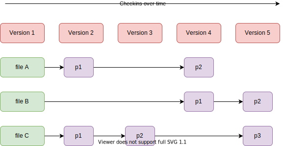
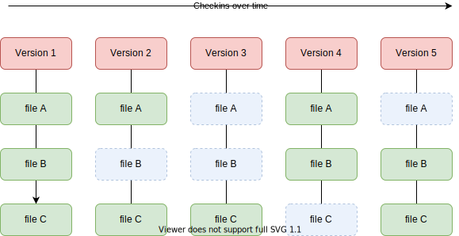

# 1. 快照，而不是补丁

Git和其他版本控制系统的主要差别在于,Git只关心文件数据的整体是否发生变化,而大多数其他系统则只关心文件内容的具体差异。这类系统(CVS,Subversion,Perforce,Bazaar 等等)每次记录有哪些文件作了更新,以及都更新了哪些行的什么内容：



演示：补丁的生成，应用补丁，撤销补丁

```bash
# 新建文件a.txt和b.txt
echo "hello" > a.txt
cp a.txt b.txt
echo "world" >> b.txt

# 生成补丁
diff a.txt b.txt > a-b.patch

# 应用补丁到a.txt： a.txt --> b.txt
patch a.txt a-b.patch

# 从b.txt撤销补丁： b.txt --> a.txt
patch -R b.txt a-b.patch
```

Git并不会保存文件前后变化的差异数据（也就是补丁），而是把变化的文件作快照后，记录在一个微型的文件系统中。每次提交更新时，它会纵览一遍所有文件的指纹信息并对文件作一次快照，然后保存一个指向这次快照的索引。为提高性能,若文件没有变化,Git不会再次保存,而只对上次保存的快照作一链接：



这是Git同其他系统的重要区别。它完全颠覆了传统版本控制的套路,并对各个环节的实现方式作了新的设计。Git更像是个小型的文件系统,但它同时还提供了许多以此为基础的超强工具,而不只是一个简单的VCS。

什么是“快照”？


如上图，假设我们在v1目录下写毕业论文，然后我们将v1目录复制为目录v2,然后修改了其中的部分文件。那么v1这个目录就是一个“历史快照”。采用复制的方式保存快照，有一个显然的问题：没有修改的文件也会复制一份，会占用额外的存储空间。怎么解决呢，一个可以想到的办法是做软链接。

# 2. Git对象

Git中有3种类型的对象：

- blob: 用于存储文件的内容，可以类比为操作系统上的文件;
- tree: 可以含有其他的多个tree或者多个blob，可以类比为操作系统上的目录, 目录下可以有多个子目录，多个文件;
- commit: 把顶层的tree，做一次快照，就好比把一个目录复制一份作为备份。


所有的对象Git都以文件的形式保存在`.git/objects`目录中。

我们新建一个目录。执行git初始化：

```bash
mkdir simple
cd simple
git init
tree .git/objects
```

会看到输出：

```txt
.git/objects
├── info
└── pack
```

只有2个空的目录：info，pack，其作用先不管，忽略之。

新增一个文件并提交, 然后再次看`.git/objects`目录的内容：

```bash
echo "hello" > a.txt
git add .
git commit -m 'add a.txt'
tree .git/objects
```

输出：

```txt
.git/objects
├── 2e
│   └── 81171448eb9f2ee3821e3d447aa6b2fe3ddba1
├── 3b
│   └── 2c3387c59ff0df98e04ce8c8f9c8eb3e940073
├── ce
│   └── 013625030ba8dba906f756967f9e9ca394464a
├── info
└── pack
```

可以看到多了3个文件。Git中每一个对象，不管是blob，还是tree，抑或是commit，都可以用一个40个字符长度的SHA-1哈希值来指代。为了不让obejcts目录下的文件过多，Git取这40个字符的前2个作为目录，后38个字符作为文件名。

为了要查看这些文件的内容，需要用到一个底层的Git命令`git cat-file`， 可以加`-t`输出对象类型，`-p`输出对象内容.

这里我们用一个简单的工具脚本来以文本形式展示各个对象文件的类型和内容：

```bash
#!/bin/bash

GIT_PRO_ROOT=$1
OUTPUT_FILE=$2

cd "$GIT_PRO_ROOT"/.git/objects || exit 1

HASH_PREFIX_ARR=$(ls)

for HASH_PREFIX in $HASH_PREFIX_ARR;
do
    HASH_LEFT_ARR=$(ls "$HASH_PREFIX")
    for HASH_LEFT in $HASH_LEFT_ARR;
    do
        HASH="${HASH_PREFIX}${HASH_LEFT}"
        {
            echo -e "HASH = $HASH"
            echo -e "TYPE = $(git cat-file -t "$HASH")"
            echo "-----"
            git cat-file -p "$HASH"
            echo -e "\n\n==========================================="
        } >> "$OUTPUT_FILE"
    done
done
```

用这个脚本来分析刚刚新建的`simeple/.git/objects`目录的内容，可以得到大致如下的输出：

```txt
HASH = 2e81171448eb9f2ee3821e3d447aa6b2fe3ddba1
TYPE = tree
-----
100644 blob ce013625030ba8dba906f756967f9e9ca394464a    a.txt


===========================================
HASH = 3b2c3387c59ff0df98e04ce8c8f9c8eb3e940073
TYPE = commit
-----
tree 2e81171448eb9f2ee3821e3d447aa6b2fe3ddba1
author 邹康60456 <60456@sangfor.com> 1609232941 +0800
committer 邹康60456 <60456@sangfor.com> 1609232941 +0800

add a.txt


===========================================
HASH = ce013625030ba8dba906f756967f9e9ca394464a
TYPE = blob
-----
hello


===========================================
```

各个hash值之间有关联关系，逻辑上可以形成数据结构中的`树`结构。可视化的展示的话就和前面的图一样。

我们再2次修改和提交：

```bash
echo "world" >> a.txt
git add .
git commit -m 'update a.txt'

echo "good" > b.txt
git add .
git commit -m 'add b.txt'
```

更新了a.txt,然后有新增一个文件b.txt, 再次看`.git/obejcts`目录的话。可以看到又多出一些对象文件。构成如下的逻辑关系：


# 3. 引用

在各种git命令中直接使用hash值也是可以的，但是hash值不易读，也不易于记忆，于是就需要为hash值取一个”别名“，也就是引用，这个其实就是”分支“的本质：分支本质上就是一个hash的别名，新建分支就是为一个hash新建一个别名，多个分支指向同一个commit，本质就是一个hash有多个不同的别名，在Git中新建一个分支的代价是很低的（在SVN中有较高代价）。

引用的维护就是用文本文件维护的，在`.git/refs`目录中，git初始化后，默认会建一个master分支，这一点可以从`.git/refs`目录中看到:

执行`tree .git/refs`输出：

```txt
.git/refs
├── heads
│   └── master
└── tags
```

查看master内容， `cat .git/refs/heads/master`, 输出一个40字符长度的hash值。

如果们新建一个分支，则会看到heads目录下多出一个和分支名同名的文件，文件的内容是分支指向的hash。

另外还有一个特殊的引用`HEAD`，它不在refs目录下，而是直接在`.git`目录下，他指向的是当前检出的分支，执行`git checkout master; cat .git/HEAD`, 可以看到输出`ref: refs/heads/master`, HEAD不仅可以执行分支，也可以直接指向一个hash，比如，我们先直接checkout到一个hash：`git checkout 3db0add`, 再执行`cat .git/HEAD`查看其内容，则会看到输出一个40位的hash值。

